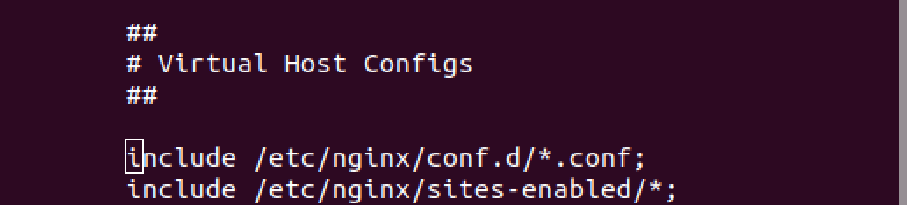
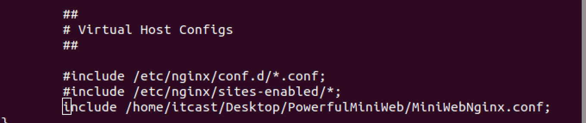

- #### 快速使用Nginx和uWSGI两个服务器部署一个前后端分离的项目

  - ##### Nginx服务器同一端口设置多个服务节点

  - ##### uWSGI启动服务的两种方式

- #### 解决跨域请求限制的简单方法，认识浏览器的同源策略

  - ##### 浏览器的同源策略是造成跨域请求限制的主要原因

  - ##### 通过响应头信息告知浏览器当前服务器允许来自某个域名的跨域请求

## 一、使用Nginx和uWSGI两个服务器部署一个前后端分离的项目

- #### 使用Nginx服务器作为静态文件服务

  - ##### 安装Nginx服务器

  ```
  sudo apt-get install nginx
  ```

  Ubuntu安装之后的文件结构大致为：

  所有的配置文件都在/etc/nginx下，并且默认启动使用的具体配置在/etc/nginx/sites-available下

  程序文件在/usr/sbin/nginx

  日志放在了/var/log/nginx中

  并已经在/etc/init.d/下创建了启动脚本nginx

  默认资源的目录设置在了/var/www (有的版本设置在了/var/www/nginx-default, 请参考/etc/nginx/sites-available里的配置)

  

  - ##### 启动Nginx服务器，并将它作为我们的静态文件服务器。

  ```shell
  # 启动命令有两种方式：
  
  sudo /etc/init.d/nginx start	# 方式一
  sudo service nginx start		# 方式二
  
  # 其实这两种启动方式的本质是一样的，都是去运行在 /etc/init.d/ 的nginx启动脚本。因此，当我们想通过 sudo service XXX start 这种服务管理器的方式管理某个软件的运行的时候就可以将改软件的启动脚本添加到 /etc/init.d 文件夹下面去【前提：该软件支持shell脚本启动】
  ```

  查看默认启动配置文件的内容，学习如何配置Nginx服务器。

  ###### 第一步：查看 /etc/nginx/nginx.conf 中的内容，因为Nginx服务器一般都是以这个配置文件启动的

  找到关键的字符串 "# Virtual Host Configs"

  

  说明，我们可以不用直接大幅度的修改编辑默认的 nginx.conf 文件，而是可以通过 include 将我们自己的配置文件包含进去。

  ###### 第二步：编辑为我们项目服务的配置文件，并将文件路径包含到 nginx.conf 中

  ```shell
  # 为MiniWeb项目服务的nginx配置文件
  # 我们将静态的html，css，js资源交给nginx服务器，因为nginx服务器在这方面更加擅长，而其也可以同时帮助我们实现前后端分离
  
  # 配置服务节点 server
  
  # 静态文件的服务节点
  server {
      # 设置监听的端口
      listen       80;
      # 设置服务器域名，也可以选择不设置
      server_name  www.miniweb.com;
  
      # 设置静态资源的路由匹配节点
      location / {
  		# 设置静态资源文件夹路径
          root   /home/itcast/Desktop/PowerfulMiniWeb/static;
  		# 设置默认的index页面
          index  index.html;
      }
  
  }
  
  # 动态数据的服务节点
  server {
      # 设置监听的端口
      listen       80;
      # 设置服务器域名，也可以选择不设置
      server_name  api.miniweb.com;
  
      # 设置动态资源的路由匹配节点
      location / {
      	# uwsgi服务器的通信地址
       	uwsgi_pass 127.0.0.1:8000;
       	# 设置uwsgi接收的请求信息，可以通过 cat /etc/nginx/uwsgi_params 查看参数内容
       	include uwsgi_params;
      }
  }
  ```

  ###### 第三步：修改 /etc/nginx/nginx.conf 文件 include 部分的内容，注释掉原来的包含关系，将为我们项目服务的配置文件路径添加进来【绝对路径，路径和文件名不一定非得和课件的一样，只要保证文件确实存在即可】

  

  ###### 第四步：重启Nginx服务器，通过浏览器查看效果

  ###### 第五步：修改主机的 /etc/hosts 文件，将对 www.miniweb.com 和 api.miniweb.com 的请求拦截到本地

  如图的最后两行所示

  

  ###### 再尝试在浏览器中直接访问 www.miniweb.com 请求静态文件。

- #### 使用 uWSGI 服务器作为动态资源的服务器

  - ##### 认识 uWSGI 服务器

    ###### 文档链接：http://uwsgi-docs-zh.readthedocs.io/zh_CN/latest/index.html

  - ##### 安装 uWSGI 服务器

    ```shell
    # 安装准备工作【这里安装是同时在两个软件，不是一个】
    apt-get install build-essential python3-dev 
    # 检查当前终端 pip 对应的安装位置，勿要想安装到 虚拟环境 中却安装到了 系统环境之中去了
    pip -V
    # 安装 uWSGI 的 Python 包【其他安装方式见文档】
    pip install uwsgi
    ```

    安装完成后通过 uwsgi 命令查看是否安装成功，如果出现大量的命令提示信息，说明安装成功！

  - ##### 开始你的第一个 uWSGI 应用

    创建一个uwsgitest .py 文件，写入如下的内容，创建一个简单的 application 应用

    ```python
    # coding:utf-8
    from pprint import pprint
    
    """
    pprint  可以美化终端中的输出效果
    
    uWSGI服务启动命令如果下
    [因为要让Nginx服务作转发,所以选择 --socket 的启动方式,如果想要直接让浏览器访问请选择 --http ]:
    uwsgi --socket 127.0.0.1:8000 --wsgi-file ./uwsgitest.py
    """
    
    
    def application(env, start_response):
        start_response('200 OK', [('Content-Type', 'text/html')])
        print('#' * 50)
        pprint(env)
        print('#' * 50)
        return [b"Hello World"]
    ```

    ###### 命令行启动服务：

    方式一

    【该方式下只能通过Nginx转发请求才能获取到application的响应，直接通过http://127.0.0.1:8000访问是无效的。因为在之前我们已经配置了 Nginx的服务节点 和 修改了/etc/hosts文件 所以我们可以通过访问http://api.miniweb.com查看application的响应内容】：

    ###### uwsgi --socket 127.0.0.1:8000 --wsgi-file ./uwsgitest.py

    方式二

    【该方式下可以直接通过http://127.0.0.1:8000获取到application的响应，但是不能通过Nginx服务器的转发获取响应了，和我们想要直接通过域名访问的需求不一致。所以仅作了解就好】

    ###### uwsgi --http 127.0.0.1:8000 --wsgi-file ./uwsgitest.py

    ###### 更多参数选项

    【指定applications对象 "--callable app" ,必须先将uwsgitest .py文件中的application函数更名为 app】

    ​	uwsgi --socket 127.0.0.1:8000 --wsgi-file ./uwsgitest.py --callable app

    【控制并发 开启四个进程，每个进程又包含两个线程 " --processes 4 --threads 2"】

    ​	uwsgi --socket 127.0.0.1:8000 --wsgi-file ./uwsgitest.py --processes 4 --threads 2 

    ###### 通过ini文件启动服务

    编辑并保存 uwsgitest.ini 文件如下，在文件所在的文件夹路径下，终端中输入 uwsgi ./uwsgitest.ini 即可启动服务

    ```ini
    # 写入的参数和命令行启动需要的参数几乎没有差别
    # 文件路径使用相对路径或绝对路径都可以,但是就官方而言,更推荐使用绝对路径
    [uwsgi]
    socket = 127.0.0.1:8000
    chdir = /home/itcast/Desktop/PowerfulMiniWeb
    wsgi-file = /home/itcast/Desktop/PowerfulMiniWeb/uwsgitest.py
    # 并发控制可以根据自己电脑情况选择,如果不设置则由uwsgi服务器自动判断
    # processes = 4
    # threads = 2
    ```

#### 就这样部署好了一个前后端分离的项目了，虽然这个项目很简陋。但重点在于学会使用过Nginx服务器和uWSGI服务器做项目的部署。

------


## 二、解决跨域请求限制的简单方法，认识浏览器的同源策略

- #### 什么叫做浏览器的同源策略？

  参照GitHub上某位前端大佬的说法如下：

  https://github.com/acgotaku/WebSecurity/blob/master/docs/content/Browser_Security/Same-Origin-Policy.md#same-origin-policy

  同源策略（Same Origin Policy）是一种约定，它是浏览器最核心也是最基本的安全功能，如果缺少了同源策略，则浏览器的正常功能可能会受到影响。可以说Web是构建在同源策略的基础之上的，浏览器只是针对同源策略的一种实现。

  **浏览器的同源策略，限制了来自不同源的“document”或脚本，对当前“document”读取或设置某些属性。**

  这一策略是极其重要的，试想如果没有同源策略，可能 a.com 的一段 JavaScript 脚本，在 b.com 未曾加载此脚本时，也可以随意涂改 b.com 的页面（在浏览器的显示中）。为了不让浏览器的页面行为发生混乱，浏览器提出了“Origin”（源）这一概念，来自不同 Origin的对象无法互相干扰。 对于JavaScript来说，以下情况被认为是同源与不同源的：

  | URL                                       | OutCome | Reason             |
  | ----------------------------------------- | ------- | ------------------ |
  | <http://test.icehoney.me/test1.html>      | Success |                    |
  | <http://test.icehoney.me/dir1/test2.html> | Success |                    |
  | <https://test.icehoney.me/secure.html>    | Failure | Different protocol |
  | <http://test.icehoney.me:81/secure.html>  | Failure | Different port     |
  | <http://blog.icehoney.me/secure.html>     | Failure | Different host     |

  由上表可知，影响“源”的因素有：host（域名或IP地址，如果是IP地址则看做一个根域名）、子域名、端口、协议。 

- #### 从后端的角度思考🤔：

  出现跨域请求限制和我们后端的代码没有任何关系，都是浏览器在做约束。实际上这个跨域的请求我们后端服务器是有接收到的，而且我们通常情况下也选择正常的给这个请求返回数据。但是由于在响应头中少了一些特定的字段，浏览器认为这些响应的数据是后端在不知情的情况下返回的，没有真正确认这个请求的合法性。所以浏览器虽然拿到了数据，但是不会解析并返回给请求的发送方，而是在控制台上抛出一个跨域请求的权限错误提示。

- #### 对比有无跨域请求情况时，请求信息的不同

  修改uwsgitest.py的代码如下,并启动uwsgi服务器：

  ```python
  # coding:utf-8
  from pprint import pprint
  
  """
  pprint  可以美化终端中的输出效果
  
  uWSGI服务启动命令如果下
  [因为要让Nginx服务作转发,所以选择 --socket 的启动方式,如果想要直接让浏览器访问请选择 --http ]:
  uwsgi --socket 127.0.0.1:8000 --wsgi-file ./uwsgitest.py
  """
  
  
  def application(env, start_response):
      start_response('200 OK', [('Content-Type', 'text/html')])
      print('#' * 50)
      pprint(env)
      print('#' * 50)
      
      # 针对于非跨域请求时我们暂时测试需要提供如下的静态资源 
      if env['PATH_INFO'] == '/':
          with open('./static/index.html', 'rb') as f:
              content = f.read()
      elif env['PATH_INFO'] == '/js/vue.min.js':
          with open('./static/js/vue.min.js', 'rb') as f:
              content = f.read()
      elif env['PATH_INFO'] == '/js/axios.min.js':
          with open('./static/js/axios.min.js', 'rb') as f:
              content = f.read()
      else:
          content = b'CORS_TEST'
      return [content]
  ```

  - ##### 使用axios发送GET请求时，对比发现在请求头信息中多出了一个 Origin 字段信息

  ```restructuredtext
  # 在浏览器中访问http://api.miniweb.com 未出现跨域请求时  浏览器里的请求行和请求头信息：
  GET /xixi?name=%E8%80%81%E7%8E%8B&age=18 HTTP/1.1
  Host: api.miniweb.com
  Connection: keep-alive
  Accept: application/json, text/plain, */*
  User-Agent: Mozilla/5.0 (X11; Linux x86_64) AppleWebKit/537.36 (KHTML, like Gecko) Chrome/67.0.3396.99 Safari/537.36
  Referer: http://api.miniweb.com/
  Accept-Encoding: gzip, deflate
  Accept-Language: zh-CN,zh;q=0.9
  
  # 在浏览器中访问http://www.miniweb.com 出现跨域请求时  浏览器里的请求行和请求头信息：
  GET /xixi?name=%E8%80%81%E7%8E%8B&age=18 HTTP/1.1
  Host: api.miniweb.com
  Connection: keep-alive
  Accept: application/json, text/plain, */*
  Origin: http://www.miniweb.com
  User-Agent: Mozilla/5.0 (X11; Linux x86_64) AppleWebKit/537.36 (KHTML, like Gecko) Chrome/67.0.3396.99 Safari/537.36
  Referer: http://www.miniweb.com/index.html
  Accept-Encoding: gzip, deflate
  Accept-Language: zh-CN,zh;q=0.9
  ```

  - ##### 使用axios发送POST请求时，我们发现POST请求莫名奇妙的变成了OPTIONS请求，这是因为浏览器发现是跨域的POST请求后会先发送一个OPTIONS请求进行预检，确认服务器的响应信息中允许该请求时才会再次真正的返送POST请求。先不管真正的POST请求，对比发现在请求头信息中多出了 Access-Control-Request-XXX 等字段信息。说明在跨域请求时，浏览器会主动的将一些特殊信息发送给服务器。

  ```restructuredtext
  # 在浏览器中访问http://api.miniweb.com未出现跨域请求时  浏览器里的请求行和请求头信息：
  POST /nihao HTTP/1.1
  Host: api.miniweb.com
  Connection: keep-alive
  Content-Length: 15
  Accept: application/json, text/plain, */*
  Origin: http://api.miniweb.com
  User-Agent: Mozilla/5.0 (X11; Linux x86_64) AppleWebKit/537.36 (KHTML, like Gecko) Chrome/67.0.3396.99 Safari/537.36
  Content-Type: application/json;charset=UTF-8
  Referer: http://api.miniweb.com/
  Accept-Encoding: gzip, deflate
  Accept-Language: zh-CN,zh;q=0.9
  
  # 在浏览器中访问http://www.miniweb.com 出现跨域请求时  浏览器里的请求行和请求头信息：
  OPTIONS /nihao HTTP/1.1
  Host: api.miniweb.com
  Connection: keep-alive
  Access-Control-Request-Method: POST
  Origin: http://www.miniweb.com
  User-Agent: Mozilla/5.0 (X11; Linux x86_64) AppleWebKit/537.36 (KHTML, like Gecko) Chrome/67.0.3396.99 Safari/537.36
  Access-Control-Request-Headers: content-type
  Accept: */*
  Accept-Encoding: gzip, deflate
  Accept-Language: zh-CN,zh;q=0.9
  ```

- #### 如何通过添加响应头就直接解决跨域请求限制的问题？

  学习HTTP协议的推荐文档：https://developer.mozilla.org/zh-CN/docs/Web/HTTP

- ##### HTTP访问控制（CORS）之HTTP 响应首部字段

  ### Access-Control-Allow-Origin

  响应首部中可以携带一个 `Access-Control-Allow-Origin` 字段，其语法如下:`

  ```
  Access-Control-Allow-Origin: <origin> | *
  ```

  其中，origin 参数的值指定了允许访问该资源的外域 URI。对于不需要携带身份凭证的请求，服务器可以指定该字段的值为通配符，表示允许来自所有域的请求。

  例如，下面的字段值将允许来自 http://mozilla.com 的请求：

  ```
  Access-Control-Allow-Origin: http://mozilla.com
  ```

  如果服务端指定了具体的域名而非“*”，那么响应首部中的 Vary 字段的值必须包含 Origin。这将告诉客户端：服务器对不同的源站返回不同的内容。

  ### Access-Control-Expose-Headers

  在跨域访问时，XMLHttpRequest对象的getResponseHeader()方法只能拿到一些最基本的响应头，Cache-Control、Content-Language、Content-Type、Expires、Last-Modified、Pragma，如果要访问其他头，则需要服务器设置本响应头。

  `Access-Control-Expose-Headers`头让服务器把允许浏览器访问的头放入白名单，例如：

  ```
  Access-Control-Expose-Headers: X-My-Custom-Header, X-Another-Custom-Header
  ```

  这样浏览器就能够通过getResponseHeader访问`X-My-Custom-Header`和 `X-Another-Custom-Header` 响应头了。

  ### Access-Control-Max-Age

  `Access-Control-Max-Age`头指定了preflight请求的结果能够被缓存多久，请参考本文在前面提到的preflight例子。

  ```
  Access-Control-Max-Age: <delta-seconds>
  ```

  `delta-seconds` 参数表示preflight请求的结果在多少秒内有效。

  ### Access-Control-Allow-Credentials

  `Access-Control-Allow-Credentials`头指定了当浏览器的`credentials`设置为true时是否允许浏览器读取response的内容。当用在对preflight预检测请求的响应中时，它指定了实际的请求是否可以使用`credentials`。

  请注意：简单 GET 请求不会被预检；如果对此类请求的响应中不包含该字段，这个响应将被忽略掉，并且浏览器也不会将相应内容返回给网页。

  ```
  Access-Control-Allow-Credentials: true
  ```

  ### Access-Control-Allow-Methods

  `Access-Control-Allow-Methods`首部字段用于预检请求的响应。其指明了实际请求所允许使用的 HTTP 方法。

  ```
  Access-Control-Allow-Methods: <method>[, <method>]*
  ```

  ### Access-Control-Allow-Headers

  `Access-Control-Allow-Headers`首部字段用于预检请求的响应。其指明了实际请求中允许携带的首部字段。

  ```
  Access-Control-Allow-Headers: <field-name>[, <field-name>]*
  ```

- ##### 了解了这么多我们去实际使用一下

  修改uwsgitest.py的代码如下：

  ```python
  # coding:utf-8
  from pprint import pprint
  
  """
  pprint  可以美化终端中的输出效果
  
  uWSGI服务启动命令如果下
  [因为要让Nginx服务作转发,所以选择 --socket 的启动方式,如果想要直接让浏览器访问请选择 --http ]:
  uwsgi --socket 127.0.0.1:8000 --wsgi-file ./uwsgitest.py
  """
  allow_host = 'http://www.miniweb.com'
  
  def application(env, start_response):
      response_line = '200 OK'
      response_headers = [('Content-Type', 'text/html')]
  	
      # 打印服务器提供给框架的请求信息
      print('#' * 20)
      pprint(env)
      # print('@'*20)
      # # 针对放在请求体中的数据需要通过下面的方式获取，并且得到的数据时bytes类型
      # input_ob = env['wsgi.input']
      # pprint(dir(input_ob))
      # pprint(input_ob.read())
      print('#' * 20)
  
      # 对于GET请求,在有跨于请求的情况下,env字典中会多处一个键'HTTP_ORIGIN'
      if (env['REQUEST_METHOD'] == 'GET') and ('HTTP_ORIGIN' in env.keys()):
          extra_headers = [
              ('Access-Control-Allow-Origin', allow_host),
              ('Access-Control-Allow-Credentials', 'true'),
          	('Set-Cookie', 'name=laowang; max-age=86400; domain=.miniweb.com; path=/'),
              ('Set-Cookie', 'name2=dazhu; max-age=86400; domain=.miniweb.com; path=/')
          ]
          response_headers.extend(extra_headers)
  
      # 对于OPTIONS这个预检请求,的处理如下
      if env['REQUEST_METHOD'] == 'OPTIONS':
          extra_headers = [
              ('Access-Control-Allow-Origin', allow_host),
              ('Access-Control-Allow-Credentials', 'true'),
              ('Access-Control-Allow-Methods', 'OPTIONS,POST'),
              ('Access-Control-Allow-Headers', 'Content-Type')
          ]
          response_headers.extend(extra_headers)
      # 对于POST请求, 跨域时 键'HTTP_ORIGIN' 对应的值为请求发送方的域名地址
      if env['REQUEST_METHOD'] == 'POST'and (env['HTTP_ORIGIN'] == allow_host):
          extra_headers = [
              ('Access-Control-Allow-Origin', allow_host),
              ('Access-Control-Allow-Credentials', 'true'),
              # ('Access-Control-Allow-Methods', 'OPTIONS,POST'),
              # ('Access-Control-Allow-Headers', 'Content-Type')
          ]
          response_headers.extend(extra_headers)
  
      # 处理非跨域时的静态资源问题
      if env['PATH_INFO'] == '/':
          with open('./static/index.html', 'rb') as f:
              content = f.read()
      elif env['PATH_INFO'] == '/js/vue.min.js':
          with open('./static/js/vue.min.js', 'rb') as f:
              content = f.read()
      elif env['PATH_INFO'] == '/js/axios.min.js':
          with open('./static/js/axios.min.js', 'rb') as f:
              content = f.read()
      else:
          content = b'CORS_TEST'
  
      # 设置响应行和响应头信息
      start_response(response_line, response_headers)
      return [content]
  
  ```

  #### 总结：

  #### 在处理跨域请求时，第一步是判断这个请求是否是跨域而来的，如果是再根据请求方式往响应头里添加告知浏览器允许跨域请求的请求头信息。

  #### 针对跨域而来的GET或POST请求，必需要在响应头中添加：

  #### `Access-Control-Allow-Origin`、`Access-Control-Allow-Credentials`

  #### 而针对特殊的OPTIONS预检请求，必需要在响应头中添加：

  #### `Access-Control-Allow-Origin`、`Access-Control-Allow-Credentials`

  #### `Access-Control-Allow-Methods`、`Access-Control-Allow-Headers`

------

