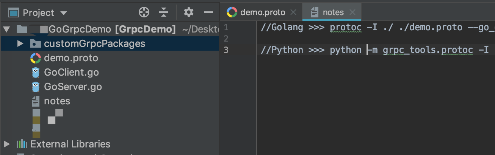
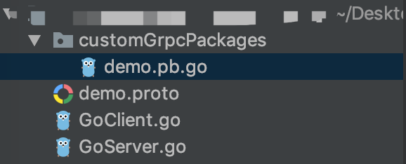

## Grpc-纯Golang的客户端与服务端demo

- #### 设计demo项目结构目录如下图:

  

- #### 接下来就是编写我们的`demo.proto`文件了, 使用的语法是`proto3`

  (PS: 语法文档<https://developers.google.cn/protocol-buffers/docs/proto3>)

````protobuf
// 声明使用的语法, 必须放在非注释第一行
syntax = "proto3";

// 声明包名(PS: Python中使用时可以省略不写)
package demo;

// 消息message是用来定义数据的, 等号后面的是字段编号
// 消息定义中的每个字段都有唯一的编号,这些字段编号用于以消息二进制格式标识字段
// 类似于Python中定义一个类, 类似于Golang中定义一个结构体
message Request {
    int64 Cid = 1;
    string ReqMsg = 2;
}

message Response {
    int64 Sid = 1;
    string RespMsg = 2;
}

// 服务service是用来gRPC的方法的, 格式固定
// 类似于Python中定义一个类, 类似于Golang中定义一个接口
service GRPCDemo {
    // 简单模式
    rpc SimpleMethod (Request) returns (Response);
    // 客户端流模式（在一次调用中, 客户端可以多次向服务器传输数据, 但是服务器只能返回一次响应）
    rpc CStreamMethod (stream Request) returns (Response);
    // 服务端流模式（在一次调用中, 客户端只能一次向服务器传输数据, 但是服务器可以多次返回响应）
    rpc SStreamMethod (Request) returns (stream Response);
    // 双向流模式 (在一次调用中, 客户端和服务器都可以向对象多次收发数据)
    rpc TWFMethod (stream Request) returns (stream Response);
}
````

- #### 使用`protoc`工具自动生成Go语言代码文件(demo包)

```shell
protoc -I ./ ./demo.proto --go_out=plugins=grpc:./customGrpcPackages
```

则会在当前目录的`customGrpcPackages`文件夹下生成一个`demo.pb.go`的文件



- #### 接下来就是写代码了	 [GitHub代码仓库](<https://github.com/kerbalwzy/Py-GoGprcDemo>)

`GoClient.go`

```go
package main

import (
	"context"
	"fmt"
	"io"
	"log"
	"sync"
	"time"

	"google.golang.org/grpc"

	demo "./customGrpcPackages"
)

const (
	GoGrpcServerAddress = "127.0.0.1:23333"
	PyGrpcServerAddress = "127.0.0.1:23334"
	ClientId            = 0
)

func main() {

	conn, err := grpc.Dial(GoGrpcServerAddress, grpc.WithInsecure())
	if err != nil {
		log.Fatal(err.Error())
	}
	defer conn.Close()

	client := demo.NewGRPCDemoClient(conn)

	// client的类型实际上是个指针， 所有下面的方法尽量不要同时调用，实测中同时调用有可能导致服务器出错
	/*
		出错信息如下：
		rpc error: code = Internal desc = transport: transport: the stream is done or WriteHeader was already called
		rpc error: code = Unavailable desc = transport is closing
		TWFMethod called, begin to recv data from client ...
		rpc error: code = Canceled desc = context canceled
		panic: runtime error: invalid memory address or nil pointer dereference
	*/
	// 每个方法单独测试时，没有问题

	CallSimpleMethod(client)

	CallCStreamMethod(client)

	CallSStreamMethod(client)

	CallTWFMethod(client)
}

// 简单模式下，直接调用client的相应方法就是普通的数据传输
func CallSimpleMethod(client demo.GRPCDemoClient) {
	log.Println("--------------Call SimpleMethod Begin---------------")
	req := demo.Request{Cid: ClientId, ReqMsg: "SimpleMethod called by Golang client"}

	// context是用来保存上下文的, 比如我们可以在里面设置这个调用的请求超时时间
	ctx, cancel := context.WithTimeout(context.TODO(), time.Second*5)
	defer cancel()
	resp, err := client.SimpleMethod(ctx, &req)
	if nil != err {
		log.Print("Call SimpleMethod error:", err.Error())
	}
	log.Printf("Get SimpleMethod Response: Sid = %d, RespMsg= %s", resp.Sid, resp.RespMsg)
	log.Println("--------------Call SimpleMethod Over----------------")
}

// 客户端流模式（在一次调用中, 客户端可以多次向服务器传输数据, 但是服务器只能返回一次响应）
// stream对象只有 Send 和 CloseAndRecv 两种方法。
func CallCStreamMethod(client demo.GRPCDemoClient) {
	log.Println("--------------Call CStreamMethod Begin--------------")
	// 获取流信息传输对象stream
	stream, err := client.CStreamMethod(context.Background())
	if nil != err {
		log.Fatal(err)
	}

	// 连续向server发送5次信息
	req := &demo.Request{Cid: ClientId}
	for i := 0; i < 5; i++ {
		req.ReqMsg = fmt.Sprintf("Golang Client stream message(%d)", i)
		err := stream.Send(req)
		if nil != err {
			log.Println(err)
		}
	}

	// 关闭发送, 并等待接收服务器的响应, 接收完成推出循环
	for {
		resp, err := stream.CloseAndRecv()
		if io.EOF == err {
			log.Println("recv data from server done")
			goto OVER
		}
		if nil != err {
			log.Println(err)
		}
		log.Printf("recv data from server(%d) massege: %s", resp.Sid, resp.RespMsg)
	}

OVER:
	log.Println("--------------Call CStreamMethod Over---------------")
}

// 服务端流模式（在一次调用中, 客户端只能一次向服务器传输数据, 但是服务器可以多次返回响应）
func CallSStreamMethod(client demo.GRPCDemoClient) {
	log.Println("--------------Call SStreamMethod Begin--------------")
	// 调用的同时就给server发送了第一次(仅一次)数据
	req := &demo.Request{Cid: ClientId, ReqMsg: "SStreamMethod called by Golang client"}
	stream, err := client.SStreamMethod(context.Background(), req)
	if nil != err {
		log.Fatal(err)
	}
	// 不断尝试接收server返回的数据
	for {
		resp, err := stream.Recv()
		if io.EOF == err {
			log.Println("recv done")
			goto OVER
		}
		if nil != err {
			log.Println(err)
		}
		log.Printf("recv from server(%d) message : %s", resp.Sid, resp.RespMsg)
	}

OVER:
	log.Println("--------------Call SStreamMethod Over---------------")
}

// 双向流模式 (在一次调用中, 客户端和服务器都可以向对象多次收发数据)
func CallTWFMethod(client demo.GRPCDemoClient) {
	log.Println("--------------Call TWFMethod Begin---------------")
	stream, err := client.TWFMethod(context.Background())
	if nil != err {
		log.Fatal(err)
	}
	// 并发收发数据
	wt := new(sync.WaitGroup)
	go func() {
		// 接收数据
		wt.Add(1)
		defer wt.Done()
		for {
			resp, err := stream.Recv()
			if io.EOF == err {
				log.Println("recv from server done")
				break
			}
			if nil != err {
				log.Println(err)
			}
			log.Printf("recv from server(%d) message: %s", resp.Sid, resp.RespMsg)
		}
	}()

	// 发送数据
	log.Println("begin to send message to server...")
	for i := 0; i < 5; i++ {
		req := &demo.Request{Cid: ClientId, ReqMsg: fmt.Sprintf("Golang client message(%d)", i)}
		err := stream.Send(req)
		if nil != err {
			log.Println(err)
		}
	}
	stream.CloseSend()
	wt.Wait()

	log.Println("--------------Call TWFMethod Over---------------")
}

```

`GoServer.go`

```go
package main

import (
	"context"
	"fmt"
	"io"
	"log"
	"net"
	"sync"

	"google.golang.org/grpc"

	demo "./customGrpcPackages"
)

const (
	ServerAddress = "127.0.0.1:23333"
	ServerId      = 0
)

func main() {
	// 开启GRPC的服务并监听请求
	listener, err := net.Listen("tcp", ServerAddress)
	if nil != err {
		log.Fatal(err)
	}

	server := grpc.NewServer()
	demo.RegisterGRPCDemoServer(server, &DemoServer{Id: ServerId})
	log.Println("------------------start Golang GRPC server")
	err = server.Serve(listener)
	if nil != err {
		log.Fatal(err)
	}
}

// 随便创建一个结构体，并实现 demo.GRPCDemoServer 接口
type DemoServer struct {
	Id int64
	wt sync.WaitGroup
}

// 简单模式
func (obj *DemoServer) SimpleMethod(ctx context.Context, req *demo.Request) (*demo.Response, error) {
	log.Printf("SimpleMethod call by Client: Cid = %d Message = %s", req.Cid, req.ReqMsg)
	resp := &demo.Response{Sid: obj.Id, RespMsg: "Go server SimpleMethod Ok!!!!"}
	return resp, nil
}

// 客户端流模式（在一次调用中, 客户端可以多次向服务器传输数据, 但是服务器只能返回一次响应）
func (obj *DemoServer) CStreamMethod(stream demo.GRPCDemo_CStreamMethodServer) error {
	log.Println("CStreamMethod called, begin to get requests from client ... ")
	// 开始不断接收客户端发送来端数据
	for {
		req, err := stream.Recv()
		if io.EOF == err {
			log.Println("recv done")
			resp := &demo.Response{Sid: ServerId, RespMsg: "Go server CStreamMethod OK!!!!"}
			return stream.SendAndClose(resp) // 事实上client只能接收到resp不能接收到return返回端error
		}
		if nil != err {
			log.Println(err)
			return err
		}
		log.Printf("recv from client(%d) message : %s", req.Cid, req.ReqMsg)
	}
}

// 服务端流模式（在一次调用中, 客户端只能一次向服务器传输数据, 但是服务器可以多次返回响应）
func (obj *DemoServer) SStreamMethod(req *demo.Request, stream demo.GRPCDemo_SStreamMethodServer) error {
	clientId, clientMsg := req.Cid, req.ReqMsg
	log.Printf("SStreamMethod called by client(%d) init message:= %s", clientId, clientMsg)

	// 开始多次向client发送数据
	log.Println("begin to send message to client...")
	for i := 0; i < 5; i++ {
		msg := fmt.Sprintf("Go server SStreamMethod (%d) OK!!!!", i)
		resp := &demo.Response{Sid: obj.Id, RespMsg: msg}
		if err := stream.Send(resp); nil != err {
			log.Println(err)
		}
	}
	log.Printf("send message to client(%d) over", clientId)

	return nil
}

// 双向流模式 (在一次调用中, 客户端和服务器都可以向对象多次收发数据)
func (obj *DemoServer) TWFMethod(stream demo.GRPCDemo_TWFMethodServer) error {
	// 并发收发数据

	// 接收数据
	go func() {
		obj.wt.Add(1)
		defer obj.wt.Done()
		log.Println("TWFMethod called, begin to recv data from client ... ")
		for {
			req, err := stream.Recv()
			if io.EOF == err {
				log.Println("recv from client over")
				break
			}
			if nil != err {
				log.Println(err)
			}
			log.Printf("recve from client(%d) message: %s", req.Cid, req.ReqMsg)

		}

	}()

	// 开始多次向client发送数据
	log.Println("TWFMethod begin to send message to client...")
	for i := 0; i < 5; i++ {
		msg := fmt.Sprintf("Go server TWFMethod (%d) OK!!!!", i)
		resp := &demo.Response{Sid: obj.Id, RespMsg: msg}
		if err := stream.Send(resp); nil != err {
			log.Println(err)
		}
	}

	obj.wt.Wait()
	return nil
}

```

