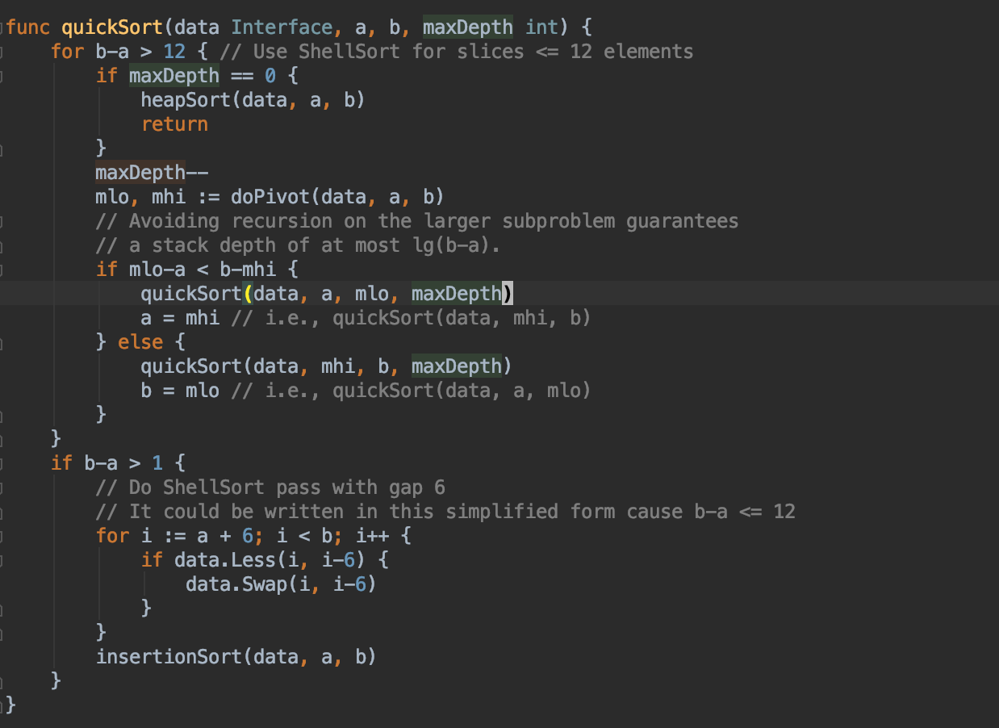

## 递归在Golang中的优势

在浏览Golang标准库源码和在看一些Golang书籍的过程中, 发现一个现象——很多地方都在用`递归`解决问题, 例如`sort`包里的`quickSort`函数, 又例如《Go语言圣经》很多地方案例的实现代码. 



#### 那么是什么驱使大佬们这么做呢?

原因如下[引自《Go语言圣经》] :

```reStructuredText
大部分编程语言使用固定大小的函数调用栈，常见的大小从64KB到2MB不等。
固定大小栈会限制递归的深度，当你用递归处理大量数据时，需要避免栈溢出；除此之外，还会导致安全性问题。
与此相反，Go语言使用可变栈，栈的大小按需增加(初始时很小)。这使得我们使用递归时不必考虑溢出和安全问题。
```

#### `在Golang中函数调用栈使用可变大小栈, 使用递归不必考虑溢出和安全问题.`

#### ⚠️`当匿名函数需要被递归时, 必须先声明一个变量, 再将匿名函数赋值给这个变量. 然后才能正常递归调用, 也就是说我们不能通 “:=” 这种自动推导类型的方式去定义需要递归使用的匿名函数. 当函数不需要被递归使用的时候, 还是可以这么使用的.`

