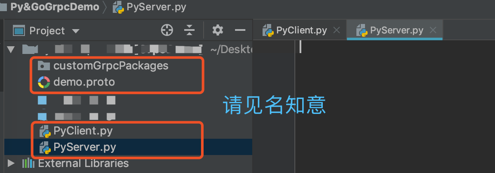
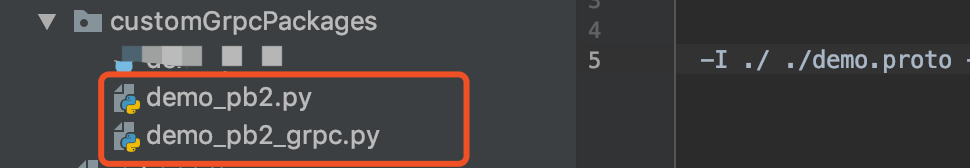

## Grpc-纯Golang的客户端与服务端demo

- #### 设计demo项目结构目录如下图:

  

- #### 接下来就是编写我们的`demo.proto`文件了, 使用的语法是`proto3`

  (PS: 语法文档<https://developers.google.cn/protocol-buffers/docs/proto3>)

````protobuf
// 声明使用的语法, 必须放在非注释第一行
syntax = "proto3";

// 声明包名(PS: Python中使用时可以省略不写)
package demo;

// 消息message是用来定义数据的, 等号后面的是字段编号
// 消息定义中的每个字段都有唯一的编号,这些字段编号用于以消息二进制格式标识字段
// 类似于Python中定义一个类, 类似于Golang中定义一个结构体
message Request {
    int64 Cid = 1;
    string ReqMsg = 2;
}

message Response {
    int64 Sid = 1;
    string RespMsg = 2;
}

// 服务service是用来gRPC的方法的, 格式固定
// 类似于Python中定义一个类, 类似于Golang中定义一个接口
service GRPCDemo {
    // 简单模式
    rpc SimpleMethod (Request) returns (Response);
    // 客户端流模式（在一次调用中, 客户端可以多次向服务器传输数据, 但是服务器只能返回一次响应）
    rpc CStreamMethod (stream Request) returns (Response);
    // 服务端流模式（在一次调用中, 客户端只能一次向服务器传输数据, 但是服务器可以多次返回响应）
    rpc SStreamMethod (Request) returns (stream Response);
    // 双向流模式 (在一次调用中, 客户端和服务器都可以向对象多次收发数据)
    rpc TWFMethod (stream Request) returns (stream Response);
}
````

- #### 使用`protoc`工具自动生成Go语言代码文件(demo包)

```shell
python -m grpc_tools.protoc -I ./ ./demo.proto --python_out=./customGrpcPackages --grpc_python_out=./customGrpcPackages
```

则会在当前目录的`customGrpcPackages`文件夹下生成`demo_pb2.py`和`demo_pb2_grpc.py`两个文件



- #### 接下来就是写代码了	 [GitHub代码仓库](<https://github.com/kerbalwzy/Py-GoGprcDemo>)

`PyClient.py`

```python
import grpc
import time
from customGrpcPackages import demo_pb2, demo_pb2_grpc

GoGrpcServerAddress = "127.0.0.1:23333"
PyGrpcServerAddress = "127.0.0.1:23334"
ClientId = 1


# 简单模式下，直接调用stub的相应方法就是普通的数据传输
def simple_method(stub):
    print("--------------Call SimpleMethod Begin--------------")
    req = demo_pb2.Request(Cid=ClientId, ReqMsg="called by Python client")
    resp = stub.SimpleMethod(req)
    print(f"get resp from server({resp.Sid}), the message: {resp.RespMsg}")
    print("--------------Call SimpleMethod Over---------------")


# 客户端流模式（在一次调用中, 客户端可以多次向服务器传输数据, 但是服务器只能返回一次响应）
def c_stream_method(stub):
    print("--------------Call CStreamMethod Begin--------------")

    # 创建一个生成器
    def req_msgs():
        for i in range(5):
            req = demo_pb2.Request(Cid=ClientId, ReqMsg=f"called by Python client, message: {i}")
            yield req

    resp = stub.CStreamMethod(req_msgs())
    print(f"get resp from server({resp.Sid}), the message: {resp.RespMsg}")
    print("--------------Call CStreamMethod Over---------------")


# 服务端流模式（在一次调用中, 客户端只能一次向服务器传输数据, 但是服务器可以多次返回响应）
def s_stream_method(stub):
    print("--------------Call SStreamMethod Begin--------------")
    req = demo_pb2.Request(Cid=ClientId, ReqMsg="called by Python client")
    resps = stub.SStreamMethod(req)
    for resp in resps:
        print(f"recv from server({resp.Sid}, message={resp.RespMsg})")

    print("--------------Call SStreamMethod Over---------------")


# 双向流模式 (在一次调用中, 客户端和服务器都可以向对象多次收发数据)
def twf_method(stub):
    print("--------------Call TWFMethod Begin---------------")

    # 创建一个req_msgs生成器
    def req_msgs():
        for i in range(5):
            req = demo_pb2.Request(Cid=ClientId, ReqMsg=f"called by Python client, message: {i}")
            yield req
            time.sleep(1)

    resps = stub.TWFMethod(req_msgs())
    for resp in resps:
        print(f"recv from server({resp.Sid}, message={resp.RespMsg})")

    print("--------------Call TWFMethod Over---------------")


def main():
    with grpc.insecure_channel(PyGrpcServerAddress) as channel:
        stub = demo_pb2_grpc.GRPCDemoStub(channel)
        simple_method(stub)
        c_stream_method(stub)
        s_stream_method(stub)
        twf_method(stub)


if __name__ == '__main__':
    main()
```

`PyServer.py`

```python
import time

import grpc
from threading import Thread
from concurrent import futures
from customGrpcPackages import demo_pb2, demo_pb2_grpc

ServerAddress = '127.0.0.1:23334'
ServerId = 1


class DemoServer(demo_pb2_grpc.GRPCDemoServicer):

    # 简单模式下，直接调用stub的相应方法就是普通的数据传输
    def SimpleMethod(self, request, context):
        print(f"SimpleMethod called by client({request.Cid}) the message: {request.ReqMsg}")
        resp = demo_pb2.Response(Sid=ServerId, RespMsg="Python server SimpleMethod Ok!!!!")
        return resp

    # 客户端流模式（在一次调用中, 客户端可以多次向服务器传输数据, 但是服务器只能返回一次响应）
    def CStreamMethod(self, request_iterator, context):
        print("CStreamMethod called by client...")
        for req in request_iterator:
            print(f"recv from client({req.Cid}), message={req.ReqMsg}")
        resp = demo_pb2.Response(Sid=ServerId, RespMsg="Python server CStreamMethod ok")
        return resp

    # 服务端流模式（在一次调用中, 客户端只能一次向服务器传输数据, 但是服务器可以多次返回响应）
    def SStreamMethod(self, request, context):
        print(f"SStreamMethod called by client({request.Cid}), message={request.ReqMsg}")

        # 创建一个生成器
        def resp_msgs():
            for i in range(5):
                resp = demo_pb2.Response(Sid=ServerId, RespMsg=f"send by Python server, message={i}")
                yield resp

        return resp_msgs()

    # 双向流模式 (在一次调用中, 客户端和服务器都可以向对象多次收发数据)
    def TWFMethod(self, request_iterator, context):
        def parse_req():
            for req in request_iterator:
                print(f"recv from client{req.Cid}, message={req.ReqMsg}")

        t = Thread(target=parse_req)
        t.start()
        for i in range(5):
            yield demo_pb2.Response(Sid=ServerId, RespMsg=f"send by Python server, message={i}")
        t.join()


def main():
    server = grpc.server(futures.ThreadPoolExecutor(max_workers=10))

    demo_pb2_grpc.add_GRPCDemoServicer_to_server(DemoServer(), server)

    server.add_insecure_port(ServerAddress)
    print("------------------start Python GRPC server")
    server.start()

    while 1:
        pass


if __name__ == '__main__':
    main()
```

