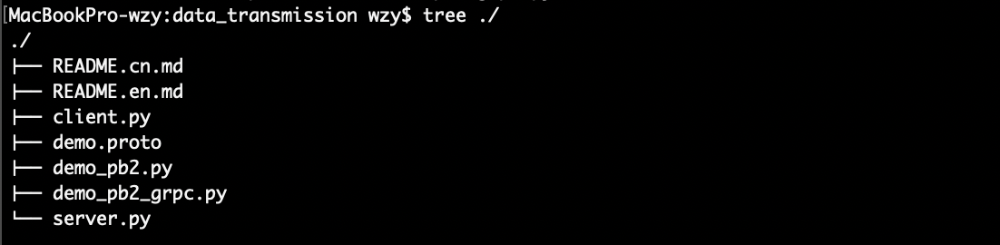

## gRPC-纯Python的客户端与服务端demo

- #### 设计demo项目结构目录如下图:

  - `demo_pb2.py`和`demo_pb2_grpc.py`这两个文件是后续通过`protoc`工具自动生成的, 不需要自己新建

  

- #### 接下来就是编写我们的`demo.proto`文件了, 使用的语法是`proto3`

  (PS: 语法文档<https://developers.google.cn/protocol-buffers/docs/proto3>)

````protobuf
// Copyright 2019 gRPC authors.
//
// Licensed under the Apache License, Version 2.0 (the "License");
// you may not use this file except in compliance with the License.
// You may obtain a copy of the License at
//
//     http://www.apache.org/licenses/LICENSE-2.0
//
// Unless required by applicable law or agreed to in writing, software
// distributed under the License is distributed on an "AS IS" BASIS,
// WITHOUT WARRANTIES OR CONDITIONS OF ANY KIND, either express or implied.
// See the License for the specific language governing permissions and
// limitations under the License.

// 语法版本声明，必须放在非注释的第一行
// Syntax version declaration. Must be placed on the first line of non-commentary.

syntax = "proto3";
// The document of proto3: https://developers.google.com/protocol-buffers/docs/proto3

// 包名定义, Python中使用时可以省略不写
// Package name definition, which can be omitted in Python.
package demo;

/*
`message`是用来定义传输的数据的格式的, 等号后面的是字段编号
消息定义中的每个字段都有唯一的编号
总体格式类似于Python中定义一个类或者Golang中定义一个结构体
*/
/*
`message` is used to define the structure of the data to be transmitted, after the equal sign
is the field number. Each field in the message definition has a unique number.
The overall format is similar to defining a class in Python or a structure in Golang.
*/
message Request {
    int64 client_id = 1;
    string request_data = 2;
}

message Response {
    int64 server_id = 1;
    string response_data = 2;
}

// `service` 是用来给gRPC服务定义方法的, 格式固定, 类似于Golang中定义一个接口
// `service` is used to define methods for gRPC services in a fixed format, similar to defining
//an interface in Golang
service GRPCDemo {
    // 一元模式(在一次调用中, 客户端只能向服务器传输一次请求数据, 服务器也只能返回一次响应)
    // unary-unary(In a single call, the client can only send request once, and the server can
    // only respond once.)
    rpc SimpleMethod (Request) returns (Response);

    // 客户端流模式（在一次调用中, 客户端可以多次向服务器传输数据, 但是服务器只能返回一次响应）
    // stream-unary (In a single call, the client can transfer data to the server several times,
    // but the server can only return a response once.)
    rpc ClientStreamingMethod (stream Request) returns (Response);

    // 服务端流模式（在一次调用中, 客户端只能一次向服务器传输数据, 但是服务器可以多次返回响应）
    // unary-stream (In a single call, the client can only transmit data to the server at one time,
    // but the server can return the response many times.)
    rpc ServerStreamingMethod (Request) returns (stream Response);

    // 双向流模式 (在一次调用中, 客户端和服务器都可以向对方多次收发数据)
    // stream-stream (In a single call, both client and server can send and receive data
    // to each other multiple times.)
    rpc BidirectionalStreamingMethod (stream Request) returns (stream Response);
}
````

- #### 使用`protoc`工具自动生成Go语言代码文件(demo包)

```shell
python -m grpc_tools.protoc -I ./ ./demo.proto --python_out=./ --grpc_python_out=./
```

则会在当前目录的`customGrpcPackages`文件夹下生成`demo_pb2.py`和`demo_pb2_grpc.py`两个文件

- #### 接下来就是写代码了	 [GitHub代码仓库](<https://github.com/grpc/grpc/tree/master/examples/python/data_transmission>)

`client.py`

```python
# Copyright 2019 gRPC authors.
#
# Licensed under the Apache License, Version 2.0 (the "License");
# you may not use this file except in compliance with the License.
# You may obtain a copy of the License at
#
#     http://www.apache.org/licenses/LICENSE-2.0
#
# Unless required by applicable law or agreed to in writing, software
# distributed under the License is distributed on an "AS IS" BASIS,
# WITHOUT WARRANTIES OR CONDITIONS OF ANY KIND, either express or implied.
# See the License for the specific language governing permissions and
# limitations under the License.
"""The example of four ways of data transmission using gRPC in Python."""

import time
import grpc

import demo_pb2_grpc
import demo_pb2

SERVER_ADDRESS = "localhost:23333"
CLIENT_ID = 1


# 一元模式(在一次调用中, 客户端只能向服务器传输一次请求数据, 服务器也只能返回一次响应)
# unary-unary(In a single call, the client can only send request once, and the server can
# only respond once.)
def simple_method(stub):
    print("--------------Call SimpleMethod Begin--------------")
    request = demo_pb2.Request(
        client_id=CLIENT_ID, request_data="called by Python client")
    response = stub.SimpleMethod(request)
    print("resp from server(%d), the message=%s" % (response.server_id,
                                                    response.response_data))
    print("--------------Call SimpleMethod Over---------------")


# 客户端流模式（在一次调用中, 客户端可以多次向服务器传输数据, 但是服务器只能返回一次响应）
# stream-unary (In a single call, the client can transfer data to the server several times,
# but the server can only return a response once.)
def client_streaming_method(stub):
    print("--------------Call ClientStreamingMethod Begin--------------")

    # 创建一个生成器
    # create a generator
    def request_messages():
        for i in range(5):
            request = demo_pb2.Request(
                client_id=CLIENT_ID,
                request_data=("called by Python client, message:%d" % i))
            yield request

    response = stub.ClientStreamingMethod(request_messages())
    print("resp from server(%d), the message=%s" % (response.server_id,
                                                    response.response_data))
    print("--------------Call ClientStreamingMethod Over---------------")


# 服务端流模式（在一次调用中, 客户端只能一次向服务器传输数据, 但是服务器可以多次返回响应）
# unary-stream (In a single call, the client can only transmit data to the server at one time,
# but the server can return the response many times.)
def server_streaming_method(stub):
    print("--------------Call ServerStreamingMethod Begin--------------")
    request = demo_pb2.Request(
        client_id=CLIENT_ID, request_data="called by Python client")
    response_iterator = stub.ServerStreamingMethod(request)
    for response in response_iterator:
        print("recv from server(%d), message=%s" % (response.server_id,
                                                    response.response_data))

    print("--------------Call ServerStreamingMethod Over---------------")


# 双向流模式 (在一次调用中, 客户端和服务器都可以向对方多次收发数据)
# stream-stream (In a single call, both client and server can send and receive data
# to each other multiple times.)
def bidirectional_streaming_method(stub):
    print(
        "--------------Call BidirectionalStreamingMethod Begin---------------")

    # 创建一个生成器
    # create a generator
    def request_messages():
        for i in range(5):
            request = demo_pb2.Request(
                client_id=CLIENT_ID,
                request_data=("called by Python client, message: %d" % i))
            yield request
            time.sleep(1)

    response_iterator = stub.BidirectionalStreamingMethod(request_messages())
    for response in response_iterator:
        print("recv from server(%d), message=%s" % (response.server_id,
                                                    response.response_data))

    print("--------------Call BidirectionalStreamingMethod Over---------------")


def main():
    with grpc.insecure_channel(SERVER_ADDRESS) as channel:
        stub = demo_pb2_grpc.GRPCDemoStub(channel)

        simple_method(stub)

        client_streaming_method(stub)

        server_streaming_method(stub)

        bidirectional_streaming_method(stub)


if __name__ == '__main__':
    main()
```

`server.py`

```python
# Copyright 2019 gRPC authors.
#
# Licensed under the Apache License, Version 2.0 (the "License");
# you may not use this file except in compliance with the License.
# You may obtain a copy of the License at
#
#     http://www.apache.org/licenses/LICENSE-2.0
#
# Unless required by applicable law or agreed to in writing, software
# distributed under the License is distributed on an "AS IS" BASIS,
# WITHOUT WARRANTIES OR CONDITIONS OF ANY KIND, either express or implied.
# See the License for the specific language governing permissions and
# limitations under the License.
"""The example of four ways of data transmission using gRPC in Python."""

from threading import Thread
from concurrent import futures

import grpc
import demo_pb2_grpc
import demo_pb2

SERVER_ADDRESS = 'localhost:23333'
SERVER_ID = 1


class DemoServer(demo_pb2_grpc.GRPCDemoServicer):

    # 一元模式(在一次调用中, 客户端只能向服务器传输一次请求数据, 服务器也只能返回一次响应)
    # unary-unary(In a single call, the client can only send request once, and the server can
    # only respond once.)
    def SimpleMethod(self, request, context):
        print("SimpleMethod called by client(%d) the message: %s" %
              (request.client_id, request.request_data))
        response = demo_pb2.Response(
            server_id=SERVER_ID,
            response_data="Python server SimpleMethod Ok!!!!")
        return response

    # 客户端流模式（在一次调用中, 客户端可以多次向服务器传输数据, 但是服务器只能返回一次响应）
    # stream-unary (In a single call, the client can transfer data to the server several times,
    # but the server can only return a response once.)
    def ClientStreamingMethod(self, request_iterator, context):
        print("ClientStreamingMethod called by client...")
        for request in request_iterator:
            print("recv from client(%d), message= %s" % (request.client_id,
                                                         request.request_data))
        response = demo_pb2.Response(
            server_id=SERVER_ID,
            response_data="Python server ClientStreamingMethod ok")
        return response

    # 服务端流模式（在一次调用中, 客户端只能一次向服务器传输数据, 但是服务器可以多次返回响应）
    # unary-stream (In a single call, the client can only transmit data to the server at one time,
    # but the server can return the response many times.)
    def ServerStreamingMethod(self, request, context):
        print("ServerStreamingMethod called by client(%d), message= %s" %
              (request.client_id, request.request_data))

        # 创建一个生成器
        # create a generator
        def response_messages():
            for i in range(5):
                response = demo_pb2.Response(
                    server_id=SERVER_ID,
                    response_data=("send by Python server, message=%d" % i))
                yield response

        return response_messages()

    # 双向流模式 (在一次调用中, 客户端和服务器都可以向对方多次收发数据)
    # stream-stream (In a single call, both client and server can send and receive data
    # to each other multiple times.)
    def BidirectionalStreamingMethod(self, request_iterator, context):
        print("BidirectionalStreamingMethod called by client...")

        # 开启一个子线程去接收数据
        # Open a sub thread to receive data
        def parse_request():
            for request in request_iterator:
                print("recv from client(%d), message= %s" %
                      (request.client_id, request.request_data))

        t = Thread(target=parse_request)
        t.start()

        for i in range(5):
            yield demo_pb2.Response(
                server_id=SERVER_ID,
                response_data=("send by Python server, message= %d" % i))

        t.join()


def main():
    server = grpc.server(futures.ThreadPoolExecutor())

    demo_pb2_grpc.add_GRPCDemoServicer_to_server(DemoServer(), server)

    server.add_insecure_port(SERVER_ADDRESS)
    print("------------------start Python GRPC server")
    server.start()
    server.wait_for_termination()

    # If raise Error:
    #   AttributeError: '_Server' object has no attribute 'wait_for_termination'
    # You can use the following code instead:
    # import time
    # while 1:
    #     time.sleep(10)


if __name__ == '__main__':
    main()
```

