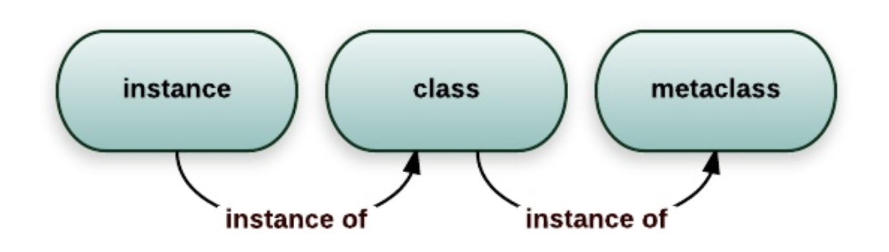
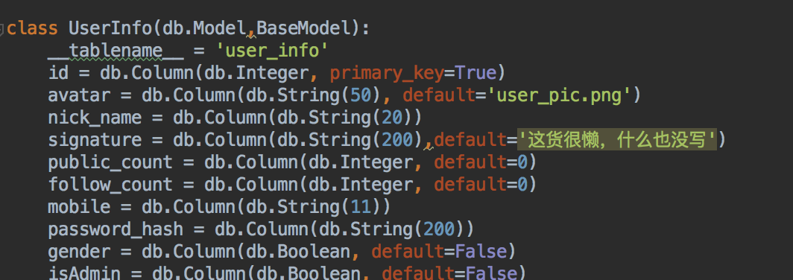
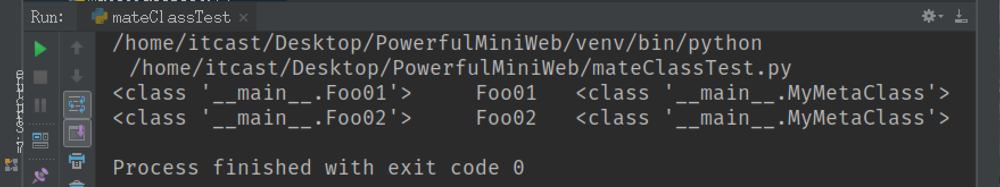

- #### 了解我们使用的ORM模块是如何通过我们定义的模型类获取到字段信息的

  - ##### 元类，创建类的多种方式

  - ##### 实现父类自动注册它的子类

## 一、了解ORM模块是如何通过模型类获取到数据表字段信息的

- #### Python中的 `元类` 是什么？

  元类制定类的创建行为，对于元类，我们可以简单的理解为用来创建类的类。

  在Python中使用 class 关键字定义类时，当类被创建的时候会搜寻所有的父类是否有指定的参数mateclass，如果都没有则使用默认的元类:  type，如果在某个父类中找到了指定的mateclass，则使用该元类来创建类。

  实际上Python中所有的类都是元类type创建的，因为你自己定义的mateclass也是必须要继承于type。

  

- #### 创建类的两种方式

  ```python
  # coding:utf-8
  
  # 第一种，使用class关键字定义一个类,这种方式的实际定义是：
  # class TestClass(object, metaclass=type)
  class TestClass01:
      name = 'TestClass01'
  
      def hello(self):
          print('hello:', self.name)
  
  
  # 第二种，使用type对象创建一个的类
  # 参数分别是 类名，父类集合，属性和方法的字典
  def say_hello(self):
      print('say hello:', self.name)
  
  
  name = 'TestClass02'
  
  TestClass02 = type(name, (object,), {'name': name, 'say_hello': say_hello})
  
  print(TestClass01, '\t', TestClass01(), '\t', TestClass01.name)
  TestClass01().hello()
  print('#' * 20)
  print(TestClass02, '\t', TestClass02(), '\t', TestClass02.name)
  TestClass02().say_hello()
  
  ```

- #### 通过指定父类的`metaclass`参数，实现自定义metaclass自动注册其创建的类

  在框架的ORM映射的学习中，同学通常有一个疑问🤔️，那就是做模型类迁移在数据库中创建出相应的数据表的时候，ORM模块是如何拿到我们定义的那些字段信息的？例如下面的模型类代码：

  

  这里的疑问就是：模型类迁移时是如何拿到UserInfo类下的id、avatar、nick_name..等这些类属性的信息的？我们好像并没有创建实例对象，也没有自己通过类对象手动去获取这些类属性。

  ###### 接下来我们通过代码实现一个场景——`通过自定义元类的属性获取到所以通过这个元类创建的类的信息`

  ```python
  # coding:utf-8
  
  # 第一步，创建一个自定义的metaclass，用来创建我们自定义的基类和基类的子类
  class MyMetaClass(type):
      # 用来记录我们自定义父类的所有子类列表
      record_cls = []
  
      # 重写__new__方法，在创建好类后，如果这个类对象不是我们的父类则将这个子类记录下来
      def __new__(cls, name, bases, attrs):
          new_cls = type.__new__(cls, name, bases, attrs)
          if name != 'BaseClass':
              MyMetaClass.record_cls.append(new_cls)
          return new_cls
  
  
  # 第二步，创建一个自定义的父类BaseClass，让后续创建的子类都继承于它
  # 并且指定这个父类BaseClass的 metaclass 参数的值为 MyMateClass
  class BaseClass(object, metaclass=MyMetaClass):
      pass
  
  
  class Foo01(BaseClass):
      name = 'Foo01'
      pass
  
  
  class Foo02(BaseClass):
      name = 'Foo02'
      pass
  
  
  # 迭代记录列表里的类，打印类的信息
  for cls in MyMetaClass.record_cls:
      print(cls, '\t', cls.name, '\t', type(cls))
      
  ```

  ##### 从打印结果来看，我们已经成功记录了所有创建子类的信息，那么我们现在大概知道`ORM模块`是如何获取我们定义的模型类里的字段属性信息了吧✌️：

  

------

