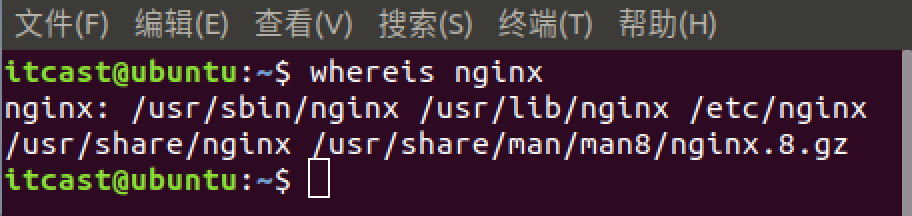

# WEB知识补充课程

#### 课程内容安排：

- #### 快速使用Nginx和uWSGI两个服务器部署一个前后端分离的项目

  - ##### Nginx服务器设置多个服务节点

  - ##### uWSGI启动服务的两种方式

- #### 解决跨域请求限制的简单方法，认识浏览器的同源策略

  - ##### 浏览器的同源策略是造成跨域请求限制的主要原因

  - ##### 通过响应头信息告知浏览器当前服务器允许来自某个域名的跨域请求

- #### 了解我们使用的ORM模块是如何通过我们定义的模型类获取到字段信息的

  - ##### 元类，创建类的多种方式

  - ##### 实现父类自动注册它的子类

- #### 基于uWSGI服务器和WSGI协议构建一个功能相对较为齐全的专门适用于前后端分离的WEB框架

  - ##### 设计框架项目的模块【文件】结构

  - ##### 了解uWSGI服务器提供的给框架的信息，并筛选出WEB在处理一个请求时可能需要用到请求信息

  - ##### 依据服务器提供给框架的请求信息内容构建我们框架的request对象的类

  - ##### 构建session工具类和用来创建并记录中间件类的元类_MiniFrameMetaClass

  - ##### 构建中间件的基类，设计中间件方法

  - ##### 了解HTTP请求的方式有哪些，并根据这些请求方式设计路由模块和类视图基类

  - ##### 了解需要框架和开发者设置的响应头的内容有哪些，并根据这些类容设计我的响应处理的相关模块

  - ##### 设计并构建核心的Application类

- #### 设计我们想要的项目初始结构，和文件内容

  - ##### 预想中的项目文件【模块】结构

  - ##### 各个文件【模块】中的内容

- #### 安装miniFrame框架到site-packages中，并完善好框架需要提供的shell命令

  - ##### 了解将自己开发的模块安装到环境中需要创建至少哪些文件

  - ##### 设计编辑完成模块shell命令的Python脚本

------


## 一、使用Nginx和uWSGI两个服务器部署一个前后端分离的项目

- #### 使用Nginx服务器作为静态文件服务

  - ##### 安装Nginx服务器

  ```
  sudo apt-get install nginx
  ```

  Ubuntu安装之后的文件结构大致为：

  所有的配置文件都在/etc/nginx下，并且默认启动使用的具体配置在/etc/nginx/sites-available下

  程序文件在/usr/sbin/nginx

  日志放在了/var/log/nginx中

  并已经在/etc/init.d/下创建了启动脚本nginx

  默认资源的目录设置在了/var/www (有的版本设置在了/var/www/nginx-default, 请参考/etc/nginx/sites-available里的配置)

  

  - ##### 启动Nginx服务器，并将它作为我们的静态文件服务器。

  ```shell
  # 启动命令有两种方式：
  
  sudo /etc/init.d/nginx start	# 方式一
  sudo service nginx start		# 方式二
  
  # 其实这两种启动方式的本质是一样的，都是去运行在 /etc/init.d/ 的nginx启动脚本。因此，当我们想通过 sudo service XXX start 这种服务管理器的方式管理某个软件的运行的时候就可以将改软件的启动脚本添加到 /etc/init.d 文件夹下面去【前提：该软件支持shell脚本启动】
  ```

  查看默认启动配置文件的内容，学习如何配置Nginx服务器。

  ###### 第一步：查看 /etc/nginx/nginx.conf 中的内容，因为Nginx服务器一般都是以这个配置文件启动的

  找到关键的字符串 "# Virtual Host Configs"

  

  说明，我们可以不用直接大幅度的修改编辑默认的 nginx.conf 文件，而是可以通过 include 将我们自己的配置文件包含进去。

  ###### 第二步：编辑为我们项目服务的配置文件，并将文件路径包含到 nginx.conf 中

  ```shell
  # 为MiniWeb项目服务的nginx配置文件
  # 我们将静态的html，css，js资源交给nginx服务器，因为nginx服务器在这方面更加擅长，而其也可以同时帮助我们实现前后端分离
  
  # 配置服务节点 server
  
  # 静态文件的服务节点
  server {
      # 设置监听的端口
      listen       80;
      # 设置服务器域名，也可以选择不设置
      server_name  www.miniweb.com;
  
      # 设置静态资源的路由匹配节点
      location / {
  		# 设置静态资源文件夹路径
          root   /home/itcast/Desktop/PowerfulMiniWeb/static;
  		# 设置默认的index页面
          index  index.html;
      }
  
  }
  
  # 动态数据的服务节点
  server {
      # 设置监听的端口
      listen       80;
      # 设置服务器域名，也可以选择不设置
      server_name  api.miniweb.com;
  
      # 设置动态资源的路由匹配节点
      location / {
      	# uwsgi服务器的通信地址
       	uwsgi_pass 127.0.0.1:8000;
       	# 设置uwsgi接收的请求信息，可以通过 cat /etc/nginx/uwsgi_params 查看参数内容
       	include uwsgi_params;
      }
  }
  ```

  ###### 第三步：修改 /etc/nginx/nginx.conf 文件 include 部分的内容，注释掉原来的包含关系，将为我们项目服务的配置文件路径添加进来【绝对路径，路径和文件名不一定非得和课件的一样，只要保证文件确实存在即可】

  

  ###### 第四步：重启Nginx服务器，通过浏览器查看效果

  ###### 第五步：修改主机的 /etc/hosts 文件，将对 www.miniweb.com 和 api.miniweb.com 的请求拦截到本地

  如图的最后两行所示

  

  ###### 再尝试在浏览器中直接访问 www.miniweb.com 请求静态文件。

- #### 使用 uWSGI 服务器作为动态资源的服务器

  - ##### 认识 uWSGI 服务器

    ###### 文档链接：http://uwsgi-docs-zh.readthedocs.io/zh_CN/latest/index.html

  - ##### 安装 uWSGI 服务器

    ```shell
    # 安装准备工作【这里安装是同时在两个软件，不是一个】
    apt-get install build-essential python3-dev 
    # 检查当前终端 pip 对应的安装位置，勿要想安装到 虚拟环境 中却安装到了 系统环境之中去了
    pip -V
    # 安装 uWSGI 的 Python 包【其他安装方式见文档】
    pip install uwsgi
    ```

    安装完成后通过 uwsgi 命令查看是否安装成功，如果出现大量的命令提示信息，说明安装成功！

  - ##### 开始你的第一个 uWSGI 应用

    创建一个uwsgitest .py 文件，写入如下的内容，创建一个简单的 application 应用

    ```python
    # coding:utf-8
    from pprint import pprint
    
    """
    pprint  可以美化终端中的输出效果
    
    uWSGI服务启动命令如果下
    [因为要让Nginx服务作转发,所以选择 --socket 的启动方式,如果想要直接让浏览器访问请选择 --http ]:
    uwsgi --socket 127.0.0.1:8000 --wsgi-file ./uwsgitest.py
    """
    
    
    def application(env, start_response):
        start_response('200 OK', [('Content-Type', 'text/html')])
        print('#' * 50)
        pprint(env)
        print('#' * 50)
        return [b"Hello World"]
    ```

    ###### 命令行启动服务：

    方式一

    【该方式下只能通过Nginx转发请求才能获取到application的响应，直接通过http://127.0.0.1:8000访问是无效的。因为在之前我们已经配置了 Nginx的服务节点 和 修改了/etc/hosts文件 所以我们可以通过访问http://api.miniweb.com查看application的响应内容】：

    ###### uwsgi --socket 127.0.0.1:8000 --wsgi-file ./uwsgitest.py

    方式二

    【该方式下可以直接通过http://127.0.0.1:8000获取到application的响应，但是不能通过Nginx服务器的转发获取响应了，和我们想要直接通过域名访问的需求不一致。所以仅作了解就好】

    ###### uwsgi --http 127.0.0.1:8000 --wsgi-file ./uwsgitest.py

    ###### 更多参数选项

    【指定applications对象 "--callable app" ,必须先将uwsgitest .py文件中的application函数更名为 app】

    ​	uwsgi --socket 127.0.0.1:8000 --wsgi-file ./uwsgitest.py --callable app

    【控制并发 开启四个进程，每个进程又包含两个线程 " --processes 4 --threads 2"】

    ​	uwsgi --socket 127.0.0.1:8000 --wsgi-file ./uwsgitest.py --processes 4 --threads 2 

    ###### 通过ini文件启动服务

    编辑并保存 uwsgitest.ini 文件如下，在文件所在的文件夹路径下，终端中输入 uwsgi ./uwsgitest.ini 即可启动服务

    ```ini
    # 写入的参数和命令行启动需要的参数几乎没有差别
    # 文件路径使用相对路径或绝对路径都可以,但是就官方而言,更推荐使用绝对路径
    [uwsgi]
    socket = 127.0.0.1:8000
    chdir = /home/itcast/Desktop/PowerfulMiniWeb
    wsgi-file = /home/itcast/Desktop/PowerfulMiniWeb/uwsgitest.py
    # 并发控制可以根据自己电脑情况选择,如果不设置则由uwsgi服务器自动判断
    # processes = 4
    # threads = 2
    ```

#### 就这样部署好了一个前后端分离的项目了，虽然这个项目很简陋。但重点在于学会使用过Nginx服务器和uWSGI服务器做项目的部署。

------


## 二、解决跨域请求限制的简单方法，认识浏览器的同源策略

- #### 什么叫做浏览器的同源策略？

  参照GitHub上某位前端大佬的说法如下：

  https://github.com/acgotaku/WebSecurity/blob/master/docs/content/Browser_Security/Same-Origin-Policy.md#same-origin-policy

  同源策略（Same Origin Policy）是一种约定，它是浏览器最核心也是最基本的安全功能，如果缺少了同源策略，则浏览器的正常功能可能会受到影响。可以说Web是构建在同源策略的基础之上的，浏览器只是针对同源策略的一种实现。

  **浏览器的同源策略，限制了来自不同源的“document”或脚本，对当前“document”读取或设置某些属性。**

  这一策略是极其重要的，试想如果没有同源策略，可能 a.com 的一段 JavaScript 脚本，在 b.com 未曾加载此脚本时，也可以随意涂改 b.com 的页面（在浏览器的显示中）。为了不让浏览器的页面行为发生混乱，浏览器提出了“Origin”（源）这一概念，来自不同 Origin的对象无法互相干扰。 对于JavaScript来说，以下情况被认为是同源与不同源的：

  | URL                                       | OutCome | Reason             |
  | ----------------------------------------- | ------- | ------------------ |
  | <http://test.icehoney.me/test1.html>      | Success |                    |
  | <http://test.icehoney.me/dir1/test2.html> | Success |                    |
  | <https://test.icehoney.me/secure.html>    | Failure | Different protocol |
  | <http://test.icehoney.me:81/secure.html>  | Failure | Different port     |
  | <http://blog.icehoney.me/secure.html>     | Failure | Different host     |

  由上表可知，影响“源”的因素有：host（域名或IP地址，如果是IP地址则看做一个根域名）、子域名、端口、协议。 

- #### 从后端的角度思考🤔：

  出现跨域请求限制和我们后端的代码没有任何关系，都是浏览器在做约束。实际上这个跨域的请求我们后端服务器是有接收到的，而且我们通常情况下也选择正常的给这个请求返回数据。但是由于在响应头中少了一些特定的字段，浏览器认为这些响应的数据是后端在不知情的情况下返回的，没有真正确认这个请求的合法性。所以浏览器虽然拿到了数据，但是不会解析并返回给请求的发送方，而是在控制台上抛出一个跨域请求的权限错误提示。

- #### 对比有无跨域请求情况时，请求信息的不同

  修改uwsgitest.py的代码如下,并启动uwsgi服务器：

  ```python
  # coding:utf-8
  from pprint import pprint
  
  """
  pprint  可以美化终端中的输出效果
  
  uWSGI服务启动命令如果下
  [因为要让Nginx服务作转发,所以选择 --socket 的启动方式,如果想要直接让浏览器访问请选择 --http ]:
  uwsgi --socket 127.0.0.1:8000 --wsgi-file ./uwsgitest.py
  """
  
  
  def application(env, start_response):
      start_response('200 OK', [('Content-Type', 'text/html')])
      print('#' * 50)
      pprint(env)
      print('#' * 50)
      
      # 针对于非跨域请求时我们暂时测试需要提供如下的静态资源 
      if env['PATH_INFO'] == '/':
          with open('./static/index.html', 'rb') as f:
              content = f.read()
      elif env['PATH_INFO'] == '/js/vue.min.js':
          with open('./static/js/vue.min.js', 'rb') as f:
              content = f.read()
      elif env['PATH_INFO'] == '/js/axios.min.js':
          with open('./static/js/axios.min.js', 'rb') as f:
              content = f.read()
      else:
          content = b'CORS_TEST'
      return [content]
  ```

  - ##### 使用axios发送GET请求时，对比发现在请求头信息中多出了一个 Origin 字段信息

  ```restructuredtext
  # 在浏览器中访问http://api.miniweb.com 未出现跨域请求时  浏览器里的请求行和请求头信息：
  GET /xixi?name=%E8%80%81%E7%8E%8B&age=18 HTTP/1.1
  Host: api.miniweb.com
  Connection: keep-alive
  Accept: application/json, text/plain, */*
  User-Agent: Mozilla/5.0 (X11; Linux x86_64) AppleWebKit/537.36 (KHTML, like Gecko) Chrome/67.0.3396.99 Safari/537.36
  Referer: http://api.miniweb.com/
  Accept-Encoding: gzip, deflate
  Accept-Language: zh-CN,zh;q=0.9
  
  # 在浏览器中访问http://www.miniweb.com 出现跨域请求时  浏览器里的请求行和请求头信息：
  GET /xixi?name=%E8%80%81%E7%8E%8B&age=18 HTTP/1.1
  Host: api.miniweb.com
  Connection: keep-alive
  Accept: application/json, text/plain, */*
  Origin: http://www.miniweb.com
  User-Agent: Mozilla/5.0 (X11; Linux x86_64) AppleWebKit/537.36 (KHTML, like Gecko) Chrome/67.0.3396.99 Safari/537.36
  Referer: http://www.miniweb.com/index.html
  Accept-Encoding: gzip, deflate
  Accept-Language: zh-CN,zh;q=0.9
  ```

  - ##### 使用axios发送POST请求时，我们发现POST请求莫名奇妙的变成了OPTIONS请求，这是因为浏览器发现是跨域的POST请求后会先发送一个OPTIONS请求进行预检，确认服务器的响应信息中允许该请求时才会再次真正的返送POST请求。先不管真正的POST请求，对比发现在请求头信息中多出了 Access-Control-Request-XXX 等字段信息。说明在跨域请求时，浏览器会主动的将一些特殊信息发送给服务器。

  ```restructuredtext
  # 在浏览器中访问http://api.miniweb.com未出现跨域请求时  浏览器里的请求行和请求头信息：
  POST /nihao HTTP/1.1
  Host: api.miniweb.com
  Connection: keep-alive
  Content-Length: 15
  Accept: application/json, text/plain, */*
  Origin: http://api.miniweb.com
  User-Agent: Mozilla/5.0 (X11; Linux x86_64) AppleWebKit/537.36 (KHTML, like Gecko) Chrome/67.0.3396.99 Safari/537.36
  Content-Type: application/json;charset=UTF-8
  Referer: http://api.miniweb.com/
  Accept-Encoding: gzip, deflate
  Accept-Language: zh-CN,zh;q=0.9
  
  # 在浏览器中访问http://www.miniweb.com 出现跨域请求时  浏览器里的请求行和请求头信息：
  OPTIONS /nihao HTTP/1.1
  Host: api.miniweb.com
  Connection: keep-alive
  Access-Control-Request-Method: POST
  Origin: http://www.miniweb.com
  User-Agent: Mozilla/5.0 (X11; Linux x86_64) AppleWebKit/537.36 (KHTML, like Gecko) Chrome/67.0.3396.99 Safari/537.36
  Access-Control-Request-Headers: content-type
  Accept: */*
  Accept-Encoding: gzip, deflate
  Accept-Language: zh-CN,zh;q=0.9
  ```

- #### 如何通过添加响应头就直接解决跨域请求限制的问题？

  学习HTTP协议的推荐文档：https://developer.mozilla.org/zh-CN/docs/Web/HTTP

- ##### HTTP访问控制（CORS）之HTTP 响应首部字段

  ### Access-Control-Allow-Origin

  响应首部中可以携带一个 `Access-Control-Allow-Origin` 字段，其语法如下:`

  ```
  Access-Control-Allow-Origin: <origin> | *
  ```

  其中，origin 参数的值指定了允许访问该资源的外域 URI。对于不需要携带身份凭证的请求，服务器可以指定该字段的值为通配符，表示允许来自所有域的请求。

  例如，下面的字段值将允许来自 http://mozilla.com 的请求：

  ```
  Access-Control-Allow-Origin: http://mozilla.com
  ```

  如果服务端指定了具体的域名而非“*”，那么响应首部中的 Vary 字段的值必须包含 Origin。这将告诉客户端：服务器对不同的源站返回不同的内容。

  ### Access-Control-Expose-Headers

  在跨域访问时，XMLHttpRequest对象的getResponseHeader()方法只能拿到一些最基本的响应头，Cache-Control、Content-Language、Content-Type、Expires、Last-Modified、Pragma，如果要访问其他头，则需要服务器设置本响应头。

  `Access-Control-Expose-Headers`头让服务器把允许浏览器访问的头放入白名单，例如：

  ```
  Access-Control-Expose-Headers: X-My-Custom-Header, X-Another-Custom-Header
  ```

  这样浏览器就能够通过getResponseHeader访问`X-My-Custom-Header`和 `X-Another-Custom-Header` 响应头了。

  ### Access-Control-Max-Age

  `Access-Control-Max-Age`头指定了preflight请求的结果能够被缓存多久，请参考本文在前面提到的preflight例子。

  ```
  Access-Control-Max-Age: <delta-seconds>
  ```

  `delta-seconds` 参数表示preflight请求的结果在多少秒内有效。

  ### Access-Control-Allow-Credentials

  `Access-Control-Allow-Credentials`头指定了当浏览器的`credentials`设置为true时是否允许浏览器读取response的内容。当用在对preflight预检测请求的响应中时，它指定了实际的请求是否可以使用`credentials`。

  请注意：简单 GET 请求不会被预检；如果对此类请求的响应中不包含该字段，这个响应将被忽略掉，并且浏览器也不会将相应内容返回给网页。

  ```
  Access-Control-Allow-Credentials: true
  ```

  ### Access-Control-Allow-Methods

  `Access-Control-Allow-Methods`首部字段用于预检请求的响应。其指明了实际请求所允许使用的 HTTP 方法。

  ```
  Access-Control-Allow-Methods: <method>[, <method>]*
  ```

  ### Access-Control-Allow-Headers

  `Access-Control-Allow-Headers`首部字段用于预检请求的响应。其指明了实际请求中允许携带的首部字段。

  ```
  Access-Control-Allow-Headers: <field-name>[, <field-name>]*
  ```

- ##### 了解了这么多我们去实际使用一下

  修改uwsgitest.py的代码如下：

  ```python
  # coding:utf-8
  from pprint import pprint
  
  """
  pprint  可以美化终端中的输出效果
  
  uWSGI服务启动命令如果下
  [因为要让Nginx服务作转发,所以选择 --socket 的启动方式,如果想要直接让浏览器访问请选择 --http ]:
  uwsgi --socket 127.0.0.1:8000 --wsgi-file ./uwsgitest.py
  """
  allow_host = 'http://www.miniweb.com'
  
  def application(env, start_response):
      response_line = '200 OK'
      response_headers = [('Content-Type', 'text/html')]
  	
      # 打印服务器提供给框架的请求信息
      print('#' * 20)
      pprint(env)
      # print('@'*20)
      # # 针对放在请求体中的数据需要通过下面的方式获取，并且得到的数据时bytes类型
      # input_ob = env['wsgi.input']
      # pprint(dir(input_ob))
      # pprint(input_ob.read())
      print('#' * 20)
  
      # 对于GET请求,在有跨于请求的情况下,env字典中会多处一个键'HTTP_ORIGIN'
      if (env['REQUEST_METHOD'] == 'GET') and ('HTTP_ORIGIN' in env.keys()):
          extra_headers = [
              ('Access-Control-Allow-Origin', allow_host),
              ('Access-Control-Allow-Credentials', 'true'),
          	('Set-Cookie', 'name=laowang; max-age=86400; domain=.miniweb.com; path=/'),
              ('Set-Cookie', 'name2=dazhu; max-age=86400; domain=.miniweb.com; path=/')
          ]
          response_headers.extend(extra_headers)
  
      # 对于OPTIONS这个预检请求,的处理如下
      if env['REQUEST_METHOD'] == 'OPTIONS':
          extra_headers = [
              ('Access-Control-Allow-Origin', allow_host),
              ('Access-Control-Allow-Credentials', 'true'),
              ('Access-Control-Allow-Methods', 'OPTIONS,POST'),
              ('Access-Control-Allow-Headers', 'Content-Type')
          ]
          response_headers.extend(extra_headers)
      # 对于POST请求, 跨域时 键'HTTP_ORIGIN' 对应的值为请求发送方的域名地址
      if env['REQUEST_METHOD'] == 'POST'and (env['HTTP_ORIGIN'] == allow_host):
          extra_headers = [
              ('Access-Control-Allow-Origin', allow_host),
              ('Access-Control-Allow-Credentials', 'true'),
              # ('Access-Control-Allow-Methods', 'OPTIONS,POST'),
              # ('Access-Control-Allow-Headers', 'Content-Type')
          ]
          response_headers.extend(extra_headers)
  
      # 处理非跨域时的静态资源问题
      if env['PATH_INFO'] == '/':
          with open('./static/index.html', 'rb') as f:
              content = f.read()
      elif env['PATH_INFO'] == '/js/vue.min.js':
          with open('./static/js/vue.min.js', 'rb') as f:
              content = f.read()
      elif env['PATH_INFO'] == '/js/axios.min.js':
          with open('./static/js/axios.min.js', 'rb') as f:
              content = f.read()
      else:
          content = b'CORS_TEST'
  
      # 设置响应行和响应头信息
      start_response(response_line, response_headers)
      return [content]
  
  ```

  #### 总结：

  #### 在处理跨域请求时，第一步是判断这个请求是否是跨域而来的，如果是再根据请求方式往响应头里添加告知浏览器允许跨域请求的请求头信息。

  #### 针对跨域而来的GET或POST请求，必需要在响应头中添加：

  #### `Access-Control-Allow-Origin`、`Access-Control-Allow-Credentials`

  #### 而针对特殊的OPTIONS预检请求，必需要在响应头中添加：

  #### `Access-Control-Allow-Origin`、`Access-Control-Allow-Credentials`

  #### `Access-Control-Allow-Methods`、`Access-Control-Allow-Headers`

------


## 三、了解ORM模块是如何通过模型类获取到数据表字段信息的

- #### Python中的 `元类` 是什么？

  元类制定类的创建行为，对于元类，我们可以简单的理解为用来创建类的类。

  在Python中使用 class 关键字定义类时，当类被创建的时候会搜寻所有的父类是否有指定的参数mateclass，如果都没有则使用默认的元类:  type，如果在某个父类中找到了指定的mateclass，则使用该元类来创建类。

  实际上Python中所有的类都是元类type创建的，因为你自己定义的mateclass也是必须要继承于type。

  

- #### 创建类的两种方式

  ```python
  # coding:utf-8
  
  # 第一种，使用class关键字定义一个类,这种方式的实际定义是：
  # class TestClass(object, metaclass=type)
  class TestClass01:
      name = 'TestClass01'
  
      def hello(self):
          print('hello:', self.name)
  
  
  # 第二种，使用type对象创建一个的类
  # 参数分别是 类名，父类集合，属性和方法的字典
  def say_hello(self):
      print('say hello:', self.name)
  
  
  name = 'TestClass02'
  
  TestClass02 = type(name, (object,), {'name': name, 'say_hello': say_hello})
  
  print(TestClass01, '\t', TestClass01(), '\t', TestClass01.name)
  TestClass01().hello()
  print('#' * 20)
  print(TestClass02, '\t', TestClass02(), '\t', TestClass02.name)
  TestClass02().say_hello()
  
  ```

- #### 通过指定父类的`metaclass`参数，实现自定义metaclass自动注册其创建的类

  在框架的ORM映射的学习中，同学通常有一个疑问🤔️，那就是做模型类迁移在数据库中创建出相应的数据表的时候，ORM模块是如何拿到我们定义的那些字段信息的？例如下面的模型类代码：

  

  这里的疑问就是：模型类迁移时是如何拿到UserInfo类下的id、avatar、nick_name..等这些类属性的信息的？我们好像并没有创建实例对象，也没有自己通过类对象手动去获取这些类属性。

  ###### 接下来我们通过代码实现一个场景——`通过自定义元类的属性获取到所以通过这个元类创建的类的信息`

  ```python
  # coding:utf-8
  
  # 第一步，创建一个自定义的metaclass，用来创建我们自定义的基类和基类的子类
  class MyMetaClass(type):
      # 用来记录我们自定义父类的所有子类列表
      record_cls = []
  
      # 重写__new__方法，在创建好类后，如果这个类对象不是我们的父类则将这个子类记录下来
      def __new__(cls, name, bases, attrs):
          new_cls = type.__new__(cls, name, bases, attrs)
          if name != 'BaseClass':
              MyMetaClass.record_cls.append(new_cls)
          return new_cls
  
  
  # 第二步，创建一个自定义的父类BaseClass，让后续创建的子类都继承于它
  # 并且指定这个父类BaseClass的 metaclass 参数的值为 MyMateClass
  class BaseClass(object, metaclass=MyMetaClass):
      pass
  
  
  class Foo01(BaseClass):
      name = 'Foo01'
      pass
  
  
  class Foo02(BaseClass):
      name = 'Foo02'
      pass
  
  
  # 迭代记录列表里的类，打印类的信息
  for cls in MyMetaClass.record_cls:
      print(cls, '\t', cls.name, '\t', type(cls))
      
  ```

  ##### 从打印结果来看，我们已经成功记录了所有创建子类的信息，那么我们现在大概知道`ORM模块`是如何获取我们定义的模型类里的字段属性信息了吧✌️：

  

------


## 四、基于uWSGI服务器和WSGI协议构建一个功能相对较为齐全的WEB框架

- #### 设计框架项目的模块【文件】结构

  - ###### 文件结构图

  

  - 各文件【模块】需要实现的功能
    - `core.py`			框架核心，用来创建application对象和uwsgi服务器交互
      `http/__init__.py`    	保存一些和处理请求相关的常量
       `http/request.py` 	保存构建请求体的基类
       `http/response.py`	保存构建响应体的基类
       `http/url`			保存构建路由对象的基类和创建路由对象的函数
       `middleware.py`		保存构建中间件的基类
       `script.py`			保存模块安装后的shell命令执行内容
       `utils.py`			保存session工具类和用来创建中间件类的元类
       `view.py`			保存类视图基类

- #### 认识uWSGI服务器向框架提供的信息有哪些？

  ###### 非跨域请求时：

  - GET

    ```
    {'CONTENT_LENGTH': '',
     'CONTENT_TYPE': '',
     'DOCUMENT_ROOT': '/usr/share/nginx/html',
     'HTTP_ACCEPT': 'application/json, text/plain, */*',
     'HTTP_ACCEPT_ENCODING': 'gzip, deflate',
     'HTTP_ACCEPT_LANGUAGE': 'zh-CN,zh;q=0.9',
     'HTTP_CONNECTION': 'keep-alive',
     'HTTP_COOKIE': 'name=laowang; name2=dazhu',  # 如果服务器在之前响应中未设置，则没有
     'HTTP_HOST': 'api.miniweb.com',
     'HTTP_REFERER': 'http://api.miniweb.com/',
     'HTTP_USER_AGENT': 'Mozilla/5.0 (X11; Linux x86_64) AppleWebKit/537.36 (KHTML, like Gecko) Chrome/67.0.3396.99 Safari/537.36',
     'PATH_INFO': '/GetTest',
     'QUERY_STRING': 'name=%E8%80%81%E7%8E%8B&age=18',
     'REMOTE_ADDR': '127.0.0.1',
     'REMOTE_PORT': '51732',
     'REQUEST_METHOD': 'GET',
     'REQUEST_SCHEME': 'http',
     'REQUEST_URI': '/GetTest?name=%E8%80%81%E7%8E%8B&age=18',
     'SERVER_NAME': 'api.miniweb.com',
     'SERVER_PORT': '80',
     'SERVER_PROTOCOL': 'HTTP/1.1',
     'uwsgi.node': b'ubuntu',
     'uwsgi.version': b'2.0.17.1',
     'wsgi.errors': <_io.TextIOWrapper name=2 mode='w' encoding='UTF-8'>,
     'wsgi.file_wrapper': <built-in function uwsgi_sendfile>,
     'wsgi.input': <uwsgi._Input object at 0x7fb4d73498a0>,
     'wsgi.multiprocess': False,
     'wsgi.multithread': False,
     'wsgi.run_once': False,
     'wsgi.url_scheme': 'http',
     'wsgi.version': (1, 0)}
    ```

  - POST

    ```
    {'CONTENT_LENGTH': '15',
     'CONTENT_TYPE': 'application/json;charset=UTF-8',
     'DOCUMENT_ROOT': '/usr/share/nginx/html',
     'HTTP_ACCEPT': 'application/json, text/plain, */*',
     'HTTP_ACCEPT_ENCODING': 'gzip, deflate',
     'HTTP_ACCEPT_LANGUAGE': 'zh-CN,zh;q=0.9',
     'HTTP_CONNECTION': 'keep-alive',
     'HTTP_CONTENT_LENGTH': '15',
     'HTTP_CONTENT_TYPE': 'application/json;charset=UTF-8',
     'HTTP_COOKIE': 'name=laowang; name2=dazhu',  # 如果服务器在之前响应中未设置，则没有
     'HTTP_HOST': 'api.miniweb.com',
     'HTTP_ORIGIN': 'http://api.miniweb.com',
     'HTTP_REFERER': 'http://api.miniweb.com/',
     'HTTP_USER_AGENT': 'Mozilla/5.0 (X11; Linux x86_64) AppleWebKit/537.36 (KHTML, like Gecko) Chrome/67.0.3396.99 Safari/537.36',
     'PATH_INFO': '/PostTest',
     'QUERY_STRING': '',
     'REMOTE_ADDR': '127.0.0.1',
     'REMOTE_PORT': '51732',
     'REQUEST_METHOD': 'POST',
     'REQUEST_SCHEME': 'http',
     'REQUEST_URI': '/PostTest',
     'SERVER_NAME': 'api.miniweb.com',
     'SERVER_PORT': '80',
     'SERVER_PROTOCOL': 'HTTP/1.1',
     'uwsgi.node': b'ubuntu',
     'uwsgi.version': b'2.0.17.1',
     'wsgi.errors': <_io.TextIOWrapper name=2 mode='w' encoding='UTF-8'>,
     'wsgi.file_wrapper': <built-in function uwsgi_sendfile>,
     'wsgi.input': <uwsgi._Input object at 0x7fb4d73498a0>,
     'wsgi.multiprocess': False,
     'wsgi.multithread': False,
     'wsgi.run_once': False,
     'wsgi.url_scheme': 'http',
     'wsgi.version': (1, 0)}
    ```

  ###### 跨域请求时：

  - GET

    ```
    {'CONTENT_LENGTH': '',
     'CONTENT_TYPE': '',
     'DOCUMENT_ROOT': '/usr/share/nginx/html',
     'HTTP_ACCEPT': 'application/json, text/plain, */*',
     'HTTP_ACCEPT_ENCODING': 'gzip, deflate',
     'HTTP_ACCEPT_LANGUAGE': 'zh-CN,zh;q=0.9',
     'HTTP_CONNECTION': 'keep-alive',
     'HTTP_COOKIE': 'name=laowang; name2=dazhu'	 # 如果服务器在之前响应中未设置，则没有
     'HTTP_HOST': 'api.miniweb.com',
     'HTTP_ORIGIN': 'http://www.miniweb.com',
     'HTTP_REFERER': 'http://www.miniweb.com/index.html',
     'HTTP_USER_AGENT': 'Mozilla/5.0 (X11; Linux x86_64) AppleWebKit/537.36 (KHTML, like Gecko) Chrome/67.0.3396.99 Safari/537.36',
     'PATH_INFO': '/GetTest',
     'QUERY_STRING': 'name=%E8%80%81%E7%8E%8B&age=18',
     'REMOTE_ADDR': '127.0.0.1',
     'REMOTE_PORT': '51758',
     'REQUEST_METHOD': 'GET',
     'REQUEST_SCHEME': 'http',
     'REQUEST_URI': '/GetTest?name=%E8%80%81%E7%8E%8B&age=18',
     'SERVER_NAME': 'api.miniweb.com',
     'SERVER_PORT': '80',
     'SERVER_PROTOCOL': 'HTTP/1.1',
     'uwsgi.node': b'ubuntu',
     'uwsgi.version': b'2.0.17.1',
     'wsgi.errors': <_io.TextIOWrapper name=2 mode='w' encoding='UTF-8'>,
     'wsgi.file_wrapper': <built-in function uwsgi_sendfile>,
     'wsgi.input': <uwsgi._Input object at 0x7f5621cf88a0>,
     'wsgi.multiprocess': False,
     'wsgi.multithread': False,
     'wsgi.run_once': False,
     'wsgi.url_scheme': 'http',
     'wsgi.version': (1, 0)}
    ```

  - OPTIONS

    ```
    {'CONTENT_LENGTH': '',
     'CONTENT_TYPE': '',
     'DOCUMENT_ROOT': '/usr/share/nginx/html',
     'HTTP_ACCEPT': '*/*',
     'HTTP_ACCEPT_ENCODING': 'gzip, deflate',
     'HTTP_ACCEPT_LANGUAGE': 'zh-CN,zh;q=0.9',
     'HTTP_ACCESS_CONTROL_REQUEST_HEADERS': 'content-type',
     'HTTP_ACCESS_CONTROL_REQUEST_METHOD': 'POST',
     'HTTP_CONNECTION': 'keep-alive',
     'HTTP_HOST': 'api.miniweb.com',
     'HTTP_ORIGIN': 'http://www.miniweb.com',
     'HTTP_USER_AGENT': 'Mozilla/5.0 (X11; Linux x86_64) AppleWebKit/537.36 (KHTML, like Gecko) Chrome/67.0.3396.99 Safari/537.36',
     'PATH_INFO': '/PostTest',
     'QUERY_STRING': '',
     'REMOTE_ADDR': '127.0.0.1',
     'REMOTE_PORT': '51772',
     'REQUEST_METHOD': 'OPTIONS',
     'REQUEST_SCHEME': 'http',
     'REQUEST_URI': '/PostTest',
     'SERVER_NAME': 'api.miniweb.com',
     'SERVER_PORT': '80',
     'SERVER_PROTOCOL': 'HTTP/1.1',
     'uwsgi.node': b'ubuntu',
     'uwsgi.version': b'2.0.17.1',
     'wsgi.errors': <_io.TextIOWrapper name=2 mode='w' encoding='UTF-8'>,
     'wsgi.file_wrapper': <built-in function uwsgi_sendfile>,
     'wsgi.input': <uwsgi._Input object at 0x7f5621cf88a0>,
     'wsgi.multiprocess': False,
     'wsgi.multithread': False,
     'wsgi.run_once': False,
     'wsgi.url_scheme': 'http',
     'wsgi.version': (1, 0)}
    ```

  - POST

    ```
    {'CONTENT_LENGTH': '15',
     'CONTENT_TYPE': 'application/json;charset=UTF-8',
     'DOCUMENT_ROOT': '/usr/share/nginx/html',
     'HTTP_ACCEPT': 'application/json, text/plain, */*',
     'HTTP_ACCEPT_ENCODING': 'gzip, deflate',
     'HTTP_ACCEPT_LANGUAGE': 'zh-CN,zh;q=0.9',
     'HTTP_CONNECTION': 'keep-alive',
     'HTTP_CONTENT_LENGTH': '15',
     'HTTP_CONTENT_TYPE': 'application/json;charset=UTF-8',
     'HTTP_COOKIE': 'name=laowang; name2=dazhu'	 # 如果服务器在之前响应中未设置，则没有
     'HTTP_HOST': 'api.miniweb.com',
     'HTTP_ORIGIN': 'http://www.miniweb.com',
     'HTTP_REFERER': 'http://www.miniweb.com/index.html',
     'HTTP_USER_AGENT': 'Mozilla/5.0 (X11; Linux x86_64) AppleWebKit/537.36 (KHTML, like Gecko) Chrome/67.0.3396.99 Safari/537.36',
     'PATH_INFO': '/PostTest',
     'QUERY_STRING': '',
     'REMOTE_ADDR': '127.0.0.1',
     'REMOTE_PORT': '51758',
     'REQUEST_METHOD': 'POST',
     'REQUEST_SCHEME': 'http',
     'REQUEST_URI': '/PostTest',
     'SERVER_NAME': 'api.miniweb.com',
     'SERVER_PORT': '80',
     'SERVER_PROTOCOL': 'HTTP/1.1',
     'uwsgi.node': b'ubuntu',
     'uwsgi.version': b'2.0.17.1',
     'wsgi.errors': <_io.TextIOWrapper name=2 mode='w' encoding='UTF-8'>,
     'wsgi.file_wrapper': <built-in function uwsgi_sendfile>,
     'wsgi.input': <uwsgi._Input object at 0x7f5621cf88a0>,
     'wsgi.multiprocess': False,
     'wsgi.multithread': False,
     'wsgi.run_once': False,
     'wsgi.url_scheme': 'http',
     'wsgi.version': (1, 0)}
    ```

  ###### 总结：

  - 关于environ的内容的总结
    - 和HTTP协议`请求头`有关的信息的键都以"HTTP"开头
    - 和请求方式及参数及客户端的有关的信息的键有`[REQUEST_METHOD, PAHT_INFO, QUERY_SRTING,REQUEST_URI,REMOTE_ADDR]`
    - 和服务器信息有关的键有`[SERVER_NAME, SERVER_PORT,SERVER_PROTOCOL,uwsgi.node,uwsgi.version,]`
    - 请求体信息需要通过键 `wsgi.input`对应的对象的read()方法提取
    - 其他更多的键对应的内容暂时不做研究
  - 关于非跨域与跨域时请求头差异的总结
    - 辨别是否为跨域请求可以通过：'HTTP_ORIGIN'和'HTTP_REFERER'  这两个键的值去判断
    - 针对跨域预检请求OPTIONS，可以通过：'HTTP_ACCESS_CONTROL_REQUEST_HEADERS' 和 'HTTP_ACCESS_CONTROL_REQUEST_METHOD'  这两个键获取更多的信息，并提供相应的响应头内容

- #### 依据服务器提供给框架的请求信息内容构建我们框架的request对象的类和session对象的类

  - ###### request对象的类，写在request.py 文件中

  ```python
  # coding:utf-8
  import json
  from urllib import parse
  
  DATA_ERROR_TIP = {
      "error": "Sorry,The miniFrame only support analysis request body data with 'application/json;charset=utf-8' type at present"
  }
  
  
  class BaseRequest:
      """
      请求体类,根据从服务器获取的请求信息构建请求体对象
      """
  
      def __init__(self, env):
          """
          初始化请求体,保存从服务器获取的请求信息,并预先留出一些保存其他数据的实例属性
          :param env: 从服务器获取的请求信息
          path_data   [预留]保存从路径中获取的参数键值对
          set_cookie   [预留]保存视图中设置的COOKIE信息
          session     [预留]保存和查询存储在服务器端的SESSION信息,保存时会同时向set_cookie中添加session_id的键值对
          """
          self.environ = env
          self.path_data = dict()
          self.set_cookies_list = list()
          self.session = None
  
      def __query_string_data(self):
          """
          获取查询字符里的请求参数键值对
          :return:  data_dict
          """
          query_string = self.environ.get('QUERY_STRING')
          query_list = parse.unquote(query_string).split('&')
          query_list = [item for item in query_list if '=' in item]
          return {item.split('=')[0]: item.split('=')[1] for item in query_list} if len(query_list) > 0 else dict()
  
      def __request_body_data(self):
          """
          获取请求体中的请求参数键值对,目前这个方法只支持解析 JSON 格式的数据
          :return:  data_dict
          """
          input_ob = self.environ.get('wsgi.input')
          data = input_ob.read()
  
          try:
              data_string = data.decode()
              data = json.loads(data_string)
          except Exception:
              data = DATA_ERROR_TIP
          finally:
              return data
  
      @property
      def url(self):
          """
          获取请求的完整URL
          :return: URL
          """
          host = self.environ.get('HTTP_HOST')
          uri = self.environ.get('REQUEST_URI')
          return host + uri
  
      @property
      def method(self):
          """
          获取请求方式
          :return: METHOD
          """
          return self.environ.get('REQUEST_METHOD')
  
      @property
      def path(self):
          """
          获取请求路径
          :return: PATH
          """
          return self.environ.get('PATH_INFO')
  
      @property
      def remote_addr(self):
          """
          获取客户端的IP地址
          :return: IP
          """
          return self.environ.get('REMOTE_ADDR')
  
      @property
      def req_data(self):
          """
          获取客户端发送过来的请求参数,无论是那种方式都从该方法中取
          :return: DATA_DICT
          """
          data_dict = dict()
          if self.environ.get('CONTENT_LENGTH'):
              data_dict.update(self.__query_string_data())
              data_dict.update(self.__request_body_data())
          else:
              data_dict.update(self.__query_string_data())
          return data_dict
  
      @property
      def cookies(self):
          """
          获取客户端发送来COOKIE信息
          :return: COOKIE_DICT
          """
          cookie_dict = dict()
          try:
              cookie_string = self.environ.get('HTTP_COOKIE')
          except Exception:
              pass
          else:
              temp_list = cookie_string.split('; ')
              if len(temp_list) > 0:
                  temp_dict = {item.split('=')[0]: item.split('=')[1] for item in temp_list}
                  cookie_dict.update(temp_dict)
          return cookie_dict
  
      @property
      def req_headers(self):
          """
          获取 请求头 信息
          :return: HEADERS_DICT
          """
          headers = dict()
          for key in self.environ.keys():
              if key.startswith('HTTP'):
                  headers[key] = self.environ.get(key)
          return headers
  
      def set_cookies(self, cookie, max_age=86400, domain=None, path='/'):
          """
          设置cookie
          :param cookie: cookie字典
          :param max_age: 最大过期时间
          :param domain: 权限域名
          :param path: 存储路径
          """
          if not isinstance(cookie, dict):
              raise TypeError('The param <cookie> should be a dict type')
          if domain is None:
              domain = self.environ.get('HTTP_HOST')
          for key, value in cookie.items():
              cookie_string = '{}={}; max-age={}; domain={}; path={}'.format(key, value, max_age, domain, path)
              self.set_cookies_list.append(cookie_string)
  
  
  if __name__ == '__main__':
      pass
  
  ```

  - ###### session对象的类，写在utils.py文件中

  ```python
  # coding:utf-8
  """
  这里是工具模块,用来存放在框架运行的过程中要用的一些功能函数或类
  
  BaseSession 用来保存往redis数据库中保存session信息,继承与字典,然后重写__setitem__和__getitem__方法
  
  """
  from redis import StrictRedis
  from hashlib import sha3_256
  
  
  class BaseSession:
      """
      类字典类
      重写关键方法,将原本的操作转到使用redis数据库完成
      """
  
      def __init__(self, session_config, secret_key, request_ob):
          self.redis_client = StrictRedis(host=session_config['host'], port=session_config['port'],
                                          db=session_config['database'])
          self.secret_key = secret_key
          self.request_ob = request_ob
  
      def __setitem__(self, key, value):
          """
          设置session信息,并保存为redis的哈希类型.
          session_id 首先尝试从请求体对象的cookies中找,如果没有则创建新的session_id并添加到请求体对象的set_cookie中去
          :param key:
          :param value:
          :return:
          """
          try:
              session_id = self.request_ob.cookies.get('session_id')
              if session_id is None:
                  secret_worker = sha3_256()
                  secret_worker.update((self.secret_key + key).encode())
                  session_id = secret_worker.hexdigest()
                  self.request_ob.set_cookies({"session_id": session_id})
              session_id = 'miniFrame-session:' + session_id
              self.redis_client.hset(name=session_id, key=key, value=value)
          except Exception as e:
              raise e
  
      def __getitem__(self, key):
          try:
              session_id = self.request_ob.cookies.get('session_id')
              if session_id is None:
                  raise KeyError(
                      'The cookies dict by request not have a key named <session_id>,'
                      'you may not create a session record before this'
                  )
              session_id = 'miniFrame-session:' + session_id
              value = self.redis_client.hget(name=session_id, key=key)
              if value is None:
                  raise KeyError(
                      "The session_id or the key nonexistent in redis database"
                  )
              return value.decode()
          except Exception as e:
              raise e
  
  
  class _MiniFrameMetaClass(type):
      # 用来记录我们自定义父类的所有子类列表
      record_cls = []
  
      # 重写__new__方法，在创建好类后，如果这个类对象不是我们的父类则将这个子类记录下来
      def __new__(cls, name, bases, attrs):
          new_cls = type.__new__(cls, name, bases, attrs)
          if not name.startswith('Base'):
              _MiniFrameMetaClass.record_cls.append(new_cls)
          return new_cls
  
  
  if __name__ == '__main__':
      pass
  
  ```

  

- #### 了解HTTP请求的方式有哪些，并根据这些请求方式设计路由模块和类视图基类。

  根据HTTP标准，HTTP请求可以使用多种请求方法。

  HTTP1.0定义了三种请求方法： GET, POST 和 HEAD方法。

  HTTP1.1新增了五种请求方法：OPTIONS, PUT, DELETE, TRACE 和 CONNECT 方法。

  | 序号 |  方法   | 描述                                                         |
  | :--: | :-----: | :----------------------------------------------------------- |
  |  1   |   GET   | 请求指定的页面信息，并返回实体主体。                         |
  |  2   |  HEAD   | 类似于get请求，只不过返回的响应中没有具体的内容，用于获取报头 |
  |  3   |  POST   | 向指定资源提交数据进行处理请求（例如提交表单或者上传文件）。数据被包含在请求体中。POST请求可能会导致新的资源的建立和/或已有资源的修改。 |
  |  4   |   PUT   | 从客户端向服务器传送的数据取代指定的文档的内容。             |
  |  5   | DELETE  | 请求服务器删除指定的页面。                                   |
  |  6   | CONNECT | HTTP/1.1协议中预留给能够将连接改为管道方式的代理服务器。     |
  |  7   | OPTIONS | 允许客户端查看服务器的性能。                                 |
  |  8   |  TRACE  | 回显服务器收到的请求，主要用于测试或诊断。                   |

  ##### 允许开发者自己做处理的请求方式主要是：`GET`、` POST`、`PUT`、`DELETE`

  ##### 让服务器或框架自己处理的请求方式主要是：`HEAD`、`OPTIONS`、`TRACE`

  ##### 预留的请求方式是：`CONNECT`

  - ###### 在http文件的`__init__.py`中放入一些常量

  ```python
  # coding:utf-8
  DEVELOPER_CONTROL_METHODS = {"GET", "POST", "PUT", "DELETE"}
  FRAME_CONTROL_METHODS = {"HEAD", "OPTIONS", "TRACE"}
  RESERVED_METHODS = {"CONNECT"}
  ```

  - ###### 设计类视图基类，写在view.py中

  ```python
  """
  视图模块,用来创建基础的视图集类.
  开发者通过编写继承与视图集基类的视图类,让框架记录这些视图以及这些视图对应的路由规则
  
  """
  
  
  class APIViewSet:
      """
      allow_methods   允许请求的方式
  
      as_view         类方法,将视图类中的所有视图方法提取出来,以请求方式为键,视图方法引用为值的方式放到
                      一个字典中去,并返回这个字典
      """
      allow_methods = {"GET", "POST", "PUT", "DELETE"}
  
      @classmethod
      def _get_default_all_methods(cls, exclude_methods=[]):
          """
          尝试获取开发者定义的与请求方式同名的视图方法
          :param  exclude_methods 要派出调的请求方式
          :return: views_dict 请求方式-视图方法 映射字典 {"请求方式":方法引用}
          """
          views_dict = dict()
          req_methods = [
              req_method for req_method in cls.allow_methods if req_method not in exclude_methods
          ]
          for req_method in req_methods:
              try:
                  __function = cls().__getattribute__(req_method.lower())
              except Exception:
                  pass
              else:
                  views_dict[req_method] = __function
          return views_dict
  
      @classmethod
      def as_view(cls, view_map=None):
          """
          将视图集类中的 视图方法与对应的请求方式
          :param view_map:    开发者自定义的请求方式-视图方法映射关系 {"请求方式":"方法名"}
          :return: views_dict 请求方式-视图方法 映射字典 {"请求方式":方法引用}
          """
          views_dict = dict()
          if view_map is None:
              views_dict.update(cls._get_default_all_methods())
  
          elif type(view_map) is not dict \
                  or set(view_map.keys()).issubset(cls.allow_methods) is False:
              raise TypeError(
                  "The param [view_map] of [as_view] must be a dict "
                  "and the keys just can chose in GET,POST,PUT,DELETE "
              )
  
          else:
              for req_method, func_name in view_map.items():
                  try:
                      __function = cls().__getattribute__(func_name)
                  except Exception as e:
                      raise e
                  else:
                      views_dict[req_method.upper()] = __function
              views_dict.update(
                  cls._get_default_all_methods(exclude_methods=view_map.keys())
              )
  
          return views_dict
  
  
  if __name__ == '__main__':
      class Test(APIViewSet):
          def get(self, request):
              print('get', request)
  
          def post(self, request):
              print('post', request),
  
          def hello(self, request):
              print("hello", request)
  
  
      views = Test.as_view({"PUT": "hello"})
      print(views)
  
  ```

- #### 构建session工具类和用来创建并记录中间件类的元类_MiniFrameMetaClass

  - ###### 将session工具类和_MiniFrameMetaClass元类，写在utils.py文件中

  ```python
  """
  路由模块,让开发者通过特定的方法能将路由规则和视图联系起来.
  当用户创建好这些映射关系后,这些路由映射关系都将被框架记录起来.
  同样使用父类自动注册子类的方法,实现记录这些路由规则对象
  """
  import re
  import inspect
  from miniFrame.http import DEVELOPER_CONTROL_METHODS, FRAME_CONTROL_METHODS, RESERVED_METHODS
  
  
  class BaseRouter:
      """
      路由对象类
      developer_control_methods   开发者控制的请求方式
      frame_control_methods       框架控制的请求方式
      reserved_methods            HTTP协议预留的请求方式
      """
      developer_control_methods = DEVELOPER_CONTROL_METHODS
      frame_control_methods = FRAME_CONTROL_METHODS
      reserved_methods = RESERVED_METHODS
  
      def __init__(self, re_url_path, views=None):
          """
          :param re_url_path        定义的路由路径正则表达式字符串
          :param views              绑定的视图字典 {"请求方式":"对应的视图函数或方法"}
          _param_compile      匹配 _re_url_path 中的参数名的正则表达式
          path_param_values   从路由中获取到的参数值字典 {"正则组名":"提取到的值"}
          """
          self.__re_url_path = re_url_path
          self.__views = views
          self.__param_compile = re.compile(r'<(.+?)>')
          self.path_param_values = None
  
      def re_check_path(self, path):
          """
          进行正则表达式字符串的路由匹配,检测请求路径是否存在,
          尝试从路径获取去参数值,并赋值给对象的path_param_values属性.
  
          :param path: 请求信息中的URL路径
  
          :return:  self --> 路由匹配成功,并返回路由对象自己
                    404  --> 路由匹配失败 not found
          """
          re_param_names = self.__param_compile.findall(self.__re_url_path)
          path_re_compile = re.compile(self.__re_url_path)
          path_re_result = path_re_compile.match(path)
          if path_re_result is not None:
              self.path_param_values = {name: path_re_result.group(name) for name in re_param_names}
              return self
          else:
              return 404
  
      def check_method(self, method):
          """
          检查请求方式是否符合规定,并针对不同的请求方式作出响应的处理
  
          :param method:  从服务器获取到的浏览器的请求方式
  
          :return: view  --> 成功匹配后对应的视图函数或方法
                   method --> 如果请求方式不在开发者控制的范围内,直接返回请求方式,让其他功能模块去处理
                   405   --> 请求方式匹配失败, method not allowed
  
          """
          if method in self.__views.keys():
              return self.__views[method]
          if method in self.frame_control_methods or method in self.reserved_methods:
              return method
          return 405
  
  
  def re_path(re_url_path, view):
      """
      根据传入的 路由 和 视图 构建一个路由对象.
      视图对象可以是个函数或者字典,如果是函数则会检测 形参是否符合语法设计;如果是字典则会检测 键是否被允许
      :param re_url_path:     路由规则的正则表达式
      :param view:            视图函数 或者 请求方式-函数 字典{'GET':view1, 'POST':view2}
      :return router          路由对象
      """
      if len(re_url_path) == 0 or type(re_url_path) is not str:
          raise TypeError(
              'url path rule string for the view is must be type of str, and length over than zero'
          )
  
      if inspect.isfunction(view):
          try:
              func_FullArgSpec = inspect.getfullargspec(view)
              func_params = func_FullArgSpec.args
              func_params_default_values = func_FullArgSpec.defaults
              if func_params != ['request', 'method']:
                  raise SyntaxError(
                      'View functions [{}] just need two params : <request> and <method>'.format(
                          view.__name__)
                  )
  
              if len(func_params_default_values) != 1 \
                      or len(func_params_default_values[0]) == 0 \
                      or type(func_params_default_values[0]) != list \
                      or set(func_params_default_values[0]).issubset(DEVELOPER_CONTROL_METHODS) is not True:
                  raise SyntaxError(
                      '\tView functions [{}] just allow and also require param <method> have a default value,'
                      '\nand the value must be a sublist of ["GET", "POST", "PUT", "DELETE"],'
                      '\nand the value not allowed be a empty list.'.format(view.__name__)
                  )
          except Exception as e:
              raise e
          else:
              views = {method.upper(): view for method in func_params_default_values[0]}
              return BaseRouter(re_url_path=re_url_path, views=views)
  
      elif type(view) is dict:
          if set(view.keys()).issubset({"GET", "POST", "PUT", "DELETE"}):
              return BaseRouter(re_url_path=re_url_path, views=view)
          else:
              raise TypeError('Here a method in your ViewSet not allowed')
      else:
          raise TypeError(
              'The second param of [ re_path() ] must be a functions or a result of your ViewSetClass.as_view()'
          )
  
  
  if __name__ == '__main__':
      pass
  
  ```

- #### 构建中间件的基类，设计中间件方法

  - ###### 将中间件的基类，写在middleware.py中

  ```python
  # coding:utf-8
  """
  用来存放中间件的模块,中间建将用主要有两个,一个是是在构建请求体之前执行,另一个是在构建响应体之后执行
  本框架的中间件将以类的形式,通过自定义类创建时指定的元类,实现父类自动注册继承与他的子类
  
  """
  from miniFrame.utils import _MiniFrameMetaClass
  
  
  class BaseMiddleWare(object, metaclass=_MiniFrameMetaClass):
  
      def before_request(self, env):
          """
          在构建请求体对象之前执行,返回的数据可以是 env字典 或者 response 对象
          如果返回的是 response 对象,则会提前完成本次请求.返回的是 env字典 的话则继续完成请求
          :param env: 请求信息字典
          :return: env or response_ob
          """
          pass
          return env
  
      def after_request(self, request):
          """
          在构建好请求体对象之后执行,返回的数据可以是 request对象 或者 response 对象
          如果返回的是 response 对象,则会提前完成本次请求.返回的是 request对象 的话则继续完成请求
          :param request: 请求体对象
          :return: request_ob or response_ob
          """
          pass
          return request
  
      def after_response(self, response):
          """
          在构建好响应体对象之后执行,返回的数据必须是响应体对象
          :param response:
          :return: response_ob
          """
          pass
          return response
  
  
  if __name__ == '__main__':
      pass
  
  ```

- #### 了解需要框架和开发者设置的响应头的内容有哪些，并根据这些类容设计我的响应处理的相关模块

  - ##### 对比浏览器拿到的响应信息和我们在testuwsgi.py中自己添加的响应信息

    我们自己设定的响应信息主要是：

    - 响应行信息：200 OK
    - 响应数据类型：('Content-Type', 'text/html')
    - 允许跨域请求相关的响应头，设置Cookie信息的响应头

    浏览器拿到的响应头信息：

    ###### 非跨域

    

    ###### 跨域

    

    ##### 可以看出部分基础信息由uWSGI和Nginx服务器帮我们自动补充好了，我们只需要关心和响应状态和其他特殊功能的响应信息即可

    ###### 常用的响应行信息

    ```python
    status_info_map = {
        200: " OK",
        201: " Created",
        202: " Accepted",
        301: " Moved Permanently",
        302: " Found",
        400: " Bad Request",
        401: " Unauthorized",
        403: " Forbidden",
        404: " Not Found",
        405: " Method Not Allowed",
        500: " Internal Server Error",
        503: " Service Unavailable",
    }
    ```

  - ###### 设计响应体基类，和在前后端分离中常用的JSON数据格式的响应体类。写在response.py中

  ```python
  # coding:utf-8
  """
  所有和处理响应信息有关的功能的代码都将放在这里
  BaseResponse    响应体基类
  
  """
  import json
  
  STATUS_CODE_SUPPORT = {
      200: " OK",
      201: " Created",
      202: " Accepted",
      301: " Moved Permanently",
      302: " Found",
      400: " Bad Request",
      401: " Unauthorized",
      403: " Forbidden",
      404: " Not Found",
      405: " Method Not Allowed",
      500: " Internal Server Error",
      503: " Service Unavailable",
  }
  
  
  class BaseResponse:
      def __init__(self, data, status_code, content_type, extra_headers={}):
          """
          初始化视图对象
          :param data: 响应的数据 <str>
          :param status_code: 响应状态码 <int>
          :param content_type: 响应内容的类型 <str>
          :param extra_headers: 额外的响应头信息 <dict>
  
          request_ob 本次请求过程中的请求体对象
          """
  
          self.data = data
          self.status_code = status_code
          self.content_type = content_type
          self.extra_headers = extra_headers
          self.request_ob = None
  
      def __check_params(self):
          """
          检查response对象的所有属性的数据类型是否符合要求
          """
          if not isinstance(self.data, str):
              raise TypeError('The data for [BaseResponse] must be a type of str')
          if not isinstance(self.status_code, int):
              raise TypeError('The status code for [BaseResponse] must be a type of int]')
          if not isinstance(self.content_type, str):
              raise TypeError('The content type for [BaseResponse] must be a type of str')
          if not isinstance(self.extra_headers, dict):
              raise TypeError('The extra_headers for [BaseResponse] must be a type of dict')
          if not self.request_ob:
              raise TypeError('The request object is None when in [BaseResponse]')
  
      def __create_response_line(self):
          """
          创建与status_code对应的响应行字符串
          :return response_line 响应行信息字符串
          """
          if self.status_code not in STATUS_CODE_SUPPORT.keys():
              raise Exception(
                  'The status code is not supported by frame at present!you can chose change source code of this frame.'
              )
          response_line = str(self.status_code) + STATUS_CODE_SUPPORT[self.status_code]
          return response_line
  
      def __create_response_headers(self):
          """
          创建相应的响应头信息的列表,数据格式:[("key", "value"), ("key", "value")]
          :return response_headers 响应头信息列表
          """
          if len(self.content_type) == 0:
              raise Exception("The Content-Type not allow be a empty string")
          response_headers = [("Content-Type", self.content_type)]
          for key, value in self.extra_headers.items():
              response_headers.append((key, value))
          for item in self.request_ob.set_cookies_list:
              response_headers.append(('Set-Cookie', item))
          return response_headers
  
      @property
      def response_data(self):
          """
          返回完成响应需要的各种信息
          :return: response_info_dict   {'line':"响应行", 'headers':"响应头", 'body':"响应体"}
          """
          self.__check_params()
          response_info_dict = dict(
              line=self.__create_response_line(),
              headers=self.__create_response_headers(),
              body=self.data.encode()
          )
          return response_info_dict
  
  
  class JsonResponse(BaseResponse):
      def __init__(self, data, status_code=200, extra_headers={}):
          if not isinstance(data, dict):
              raise Exception("JsonResponse only support data type of dict")
          content_type = "application/json;charset=utf-8"
          data = json.dumps(data)
          super().__init__(
              data=data,
              status_code=status_code,
              content_type=content_type,
              extra_headers=extra_headers
          )
  
  
  class HTTPResponse(BaseResponse):
      def __init__(self, data, status_code=200, extra_headers={}):
          if not isinstance(data, str):
              raise Exception("HTTPResponse only support data type of str")
          content_type = "text/html;charset=utf-8"
          super().__init__(
              data=data,
              status_code=status_code,
              content_type=content_type,
              extra_headers=extra_headers
          )
  
  
  class Redirect(BaseResponse):
      def __init__(self, url, status_code=302, extra_headers={}):
          if not isinstance(url, str):
              raise Exception("The url to redirect must be a string")
          if status_code in [301, 302]:
              extra_headers['Location'] = url
              super().__init__(
                  data="",
                  status_code=status_code,
                  content_type='text/html',
                  extra_headers=extra_headers
              )
          else:
              raise Exception("The status code for redirect must be 3XX")
  
  
  if __name__ == '__main__':
      pass
  
  ```

- #### 设计并构建核心的Application类

  - ###### 将框架对请求信息做处理的核心流程类，写在core.py文件中

  ```python
  # coding:utf-8
  """
  框架的核心，接受从服务器转发进来的数据，
  判断请求是否允许
  构建请求对象
  调用相应的视图，获取响应
  构建响应对象，并将数据返回给服务器
  """
  import importlib
  from miniFrame.utils import _MiniFrameMetaClass
  from miniFrame.http.response import BaseResponse, HTTPResponse
  from miniFrame.http.request import BaseRequest
  from miniFrame.utils import BaseSession
  from miniFrame.http.url import BaseRouter
  from miniFrame.http import FRAME_CONTROL_METHODS
  
  
  class MiniFrame:
  
      def __init__(self, config_import_path=None):
          """
          初始化MiniFrame对象,并可以选则在此时通过config模块的导包路径 加载配置项
          """
          if config_import_path is None:
              return
          try:
              self.__add_config_from_import_path(config_import_path)
          except Exception as e:
              raise e
  
      def __call__(self, env, set_resp_headers):
          """
          当对象被调用时执行该方法
          :return: 响应信息
          """
          # 构建请求体对象
          request_ob = BaseRequest(env)
          request_ob.session = BaseSession(
              session_config=self.database_conf['Redis'],
              secret_key=self.SECRET_KEY,
              request_ob=request_ob
          )
  
          # 获取到所有的中间件对象,并保存到列表中
          middleware_ob_list = self.__get_middleware_obs()
  
          # 执行所有中间件对象中 "before_request" 方法,并判断返回值
          env = self.__before_request(
              env=env,
              middleware_obs=middleware_ob_list
          )
          if isinstance(env, BaseResponse):
              env.request_ob = request_ob
              info_dict = env.response_data
              set_resp_headers(info_dict["line"], info_dict["headers"])
              return info_dict["body"]
  
          # 执行所有中间对象中的 "after_request" 方法,并判断返回值
          request = self.__after_request(
              request_ob=request_ob,
              middleware_obs=middleware_ob_list
          )
          if isinstance(request, BaseResponse):
              request.request_ob = request_ob
              info_dict = request.response_data
              set_resp_headers(info_dict["line"], info_dict["headers"])
              return info_dict["body"]
  
          # 执行 "__get_router_ob "检查路径,尝试获取 router 对象
          router_ob = self.__get_router_ob(path_info=request_ob.path)
          if router_ob is None:
              response = HTTPResponse(data="Not Found", status_code=404)
              response.request_ob = request_ob
              info_dict = response.response_data
              set_resp_headers(info_dict["line"], info_dict["headers"])
              return info_dict["body"]
  
          # 执行 router_ob 对象的 "_check_method" 方法,检查请求方式,尝试获取 视图函数或方法
          view_method = router_ob.check_method(method=request_ob.method)
          print("--[view method]--", view_method, ":>:", env.get('REQUEST_URI'))
          if view_method == 405:
              response = HTTPResponse(data="Method not allowed", status_code=405)
              info_dict = response.response_data
              set_resp_headers(info_dict["line"], info_dict["headers"])
              return info_dict["body"]
  
          if view_method in FRAME_CONTROL_METHODS:
              tip = "处理跨域或者其他由框架处理的请求方式的代码就交给同学们自己研究啦"
              set_resp_headers('200 OK', [("Content-Type", "text/html;charset=utf-8")])
              return tip.encode()
  
          # 将 router_ob对象 携带的从路径中提取的参数添加给 request对象
          request_ob.path_data = router_ob.path_param_values
  
          # 执行视图函数或方法,获取响应对象,并判断对象是否合法
          response_ob = view_method(request_ob)
          if not isinstance(response_ob, BaseResponse):
              raise TypeError("The view function or method need return a Response object!")
  
          # 为 response_ob 对象的属性 request_ob 添加值
          response_ob.request_ob = request_ob
  
          # 执行所有中间件对象中 "after_response" 方法,并判断返回值
          response_ob = self.__after_response(
              response_ob=response_ob,
              middleware_obs=middleware_ob_list
          )
          if not isinstance(response_ob, BaseResponse):
              raise TypeError(
                  "The method [after_response ] of middleware class need return a Response object!"
              )
  
          # 一切都没有问题,设置响应头信息,并返回响应体数据
          info_dict = response_ob.response_data
          set_resp_headers(info_dict["line"], info_dict["headers"])
          return info_dict["body"]
  
      def __get_middleware_obs(self):
          """
          获取所有年的中间件类,并创建对象添加到列表中去
          :return: 中间件对象列表
          """
          cls_list = _MiniFrameMetaClass.record_cls
          return [cls() for cls in cls_list]
  
      def __before_request(self, env, middleware_obs):
          """
          执行所有中间对象的 before_request 方法
          :param env: 请求信息字典
          :param middleware_obs: 中间件对象列表
          :return: env or response_ob
          """
          for mid_ob in middleware_obs:
              env = mid_ob.before_request(env)
              if isinstance(env, BaseResponse):
                  return env
          return env
  
      def __after_request(self, request_ob, middleware_obs):
          """
          执行所有中间对象的 after_request 方法
          :param request_ob: 请求体对象
          :param middleware_obs: 中间件对象列表
          :return: request_ob or response_ob
          """
          for mid_ob in middleware_obs:
              request_ob = mid_ob.after_request(request_ob)
              if isinstance(request_ob, BaseResponse):
                  return request_ob
          return request_ob
  
      def __get_router_ob(self, path_info):
          """
          遍历所有注册了的路由对象去校验路由,直到路由匹配成功,或在全部失败
          :param path_info: 请求路径
          :return: router_ob or None
          """
          for router_ob in self.routers:
              ret = router_ob.re_check_path(path=path_info)
              if isinstance(ret, BaseRouter):
                  return ret
  
      def __after_response(self, response_ob, middleware_obs):
          """
          执行所有中间对象的 after_response 方法
          :param response_ob: 响应体对象
          :param middleware_obs: 中间件对象列表
          :return: response_ob
          """
          for mid_ob in middleware_obs:
              response_ob = mid_ob.after_response(response_ob)
          return response_ob
  
      def __add_config_from_import_path(self, config_import_path):
          # 导入config模块,并将模块对象用, 并将其添加给类属性
          config_module_ob = importlib.import_module(config_import_path)
  
          # 通过config模块对象获取所有允许访问的ORIGIN列表
          self.allow_origins = config_module_ob.ALLOW_ORIGIN
  
          # 通过config模块对象获取所有的路由对象
          routers_path_list = config_module_ob.ROUTERS_PATH
          self.routers = list()
          for router_import_path in routers_path_list:
              router_module_ob = importlib.import_module(router_import_path)
              routers_list = router_module_ob.path_map
              self.routers.extend(routers_list)
  
          # 通过config模块对象获取所有的中间件模块的导包路径,并导入这些模块.
          # 那么这些中间件模块的中的创建中间子类代码执行后,会被我们自定义的元类注册.
          middleware_import_paths = config_module_ob.MIDDLEWARE_PATH
          for middleware_import_path in middleware_import_paths:
              importlib.import_module(middleware_import_path)
  
          # 通过config模块对象获取所有关于数据库的配置,并保存为实例属性
          self.database_conf = config_module_ob.DATABASE_CONFIG
  
          # 通过config模块对象获取设置的密钥混淆字符串
          self.SECRET_KEY = config_module_ob.SECRET_KEY
  
      def init_app(self, config_import_path):
          try:
              self.__add_config_from_import_path(config_import_path)
          except Exception as e:
              raise e
  
  
  if __name__ == '__main__':
      pass
  
  ```

------


## 五、设计我们想要的项目初始结构，和文件内容

- ##### 预想中的项目文件【模块】结构

###### 

- ##### 各个文件【模块】中的内容

  - `ApiStore/config.py`			项目相关的配置
  	 `ApiStore/middelware.py`		开发者定义的中间件
  	 `ApiStore/models.py`			模型类
  	 `ApiStore/routers.py`		配置视图路由，创建路由对象
  	 `ApiViews/exampleViews.py`	视图
  	 `manager.py`					项目启动主文件	
  	 `uwsgi.ini`				        项目启动uWSGI服务配置文件

- ##### 各文件【模块】具体代码

  ApiStore/config.py

  ```python
  # coding:utf-8
  # these are the configs for this Project
  
  """
  配置文件,配置项变量名的对应的数据类型必须是列表或字典,否则可能造成此配置项无法被加载.
  已经预设好的配置项的变量名不允许修改.
  允许添加符合规则的自定义配置项,可以在代码中通过全局的 MiniFrame.
  """
  # 加密混淆字符串
  SECRET_KEY = "Please set your secret key here"
  
  # 路由导包路径
  ROUTERS_PATH = [
      'ApiStore.routers'
  ]
  
  # 允许访问的域名
  ALLOW_ORIGIN = [
      '127.0.0.1:8000'
  ]
  
  # 中间件的导包路径
  MIDDLEWARE_PATH = [
      'ApiStore.middleware'
  ]
  
  # 数据库的相关配置
  DATABASE_CONFIG = {
      "MySQL": {
          "host": "127.0.0.1",
          "port": 3306,
          "database": "miniframe",
          "user": "root",
          "password": "mysql"
      },
      "Redis": {
          "host": '127.0.0.1',
          "port": 6379,
          "database": 0
  
      }
  }
  
  ```

  ApiStore/routers.py

  ```python
  # coding:utf-8
  from miniFrame.http.url import re_path
  from ApiViews import exampleViews
  
  path_map = [
      re_path(r'^/$', exampleViews.ExcampleViewSet.as_view()),
      re_path(r'^/index/(?P<testParam>.+)/$', exampleViews.excampleViewFunc),
  
  ]
  
  ```

  ApiViews/exampleViews.py

  ```python
  # coding:utf-8
  from miniFrame.view import APIViewSet
  from miniFrame.http.response import HTTPResponse, JsonResponse
  
  
  class ExcampleViewSet(APIViewSet):
  
      def get(self, request):
          print("#" * 20, "ExcampleViewSet.get")
          print("path prams data:", request.path_data)
          print("query string and request body data:", request.req_data)
          return HTTPResponse(data="Hello GET")
  
      def post(self, request):
          print("#" * 20, "ExcampleViewSet.post")
          print("path prams data:", request.path_data)
          print("query string and request body data:", request.req_data)
          return HTTPResponse(data="Hello POST")
  
  
  def excampleViewFunc(request, method=['GET']):
      print("#" * 20, "excampleViewFunc")
      print("path prams data:", request.path_data)
      print("query string and request body data:", request.req_data)
      return JsonResponse(data={"hello": "excampleViewFunc"})
  
  ```

  manager.py

  ```python
  # coding:utf-8
  import os
  import sys
  from miniFrame.core import MiniFrame
  
  BaseDir = os.path.dirname(os.path.abspath(__file__))
  sys.path.insert(0, BaseDir)
  CONFIG_IMPORT_PATH = 'ApiStore.config'
  
  
  def application(env, start_response):
      try:
          mini_app = MiniFrame()
          mini_app.init_app(config_import_path=CONFIG_IMPORT_PATH)
      except Exception as e:
          raise e
      else:
          return mini_app(env=env, set_resp_headers=start_response)
  
  
  if __name__ == '__main__':
      pass
  
  ```

  uwsgi.ini

  ```ini
  [uwsgi]
  ;socket = 127.0.0.1:8000
  http = 127.0.0.1:8000
  chdir = /home/itcast/Desktop/installFrame/excample
  wsgi-file = /home/itcast/Desktop/installFrame/excample/manager.py
  
  ```

------


## 六、安装miniFrame框架到site-packages中，并完善好框架需要提供的shell命令

- ##### 了解将自己开发的模块安装到环境中需要创建至少哪些文件

  - ##### 简易教程链接：https://ecmadao.gitbooks.io/python3/content/setuppy.html 【需要科学上网】

  - ##### 项目许可证选择链接：https://choosealicense.com/

  - ##### 编辑setup.py文件

    ```python
    # coding:utf-8
    # 引用包管理工具setuptools，其中find_packages可以帮我们便捷的找到自己代码中编写的库
    from setuptools import setup, find_packages
    
    setup(
        name='miniFrame',  # 包名称，之后如果上传到了pypi，则需要通过该名称下载
        version='0.1',  # version只能是数字，其他字符则会报错
        keywords=('miniweb', 'miniFrame', 'heima', 'itcast'),
        description='A custom framework for use in ItCast HeiMa Python teaching',
        long_description='',
        license='MIT',  # 遵循的协议
        install_requires=['redis', 'uwsgi'],  # 这里面填写项目用到的第三方依赖
        author='wangzhongying',
        author_email='kerbalwzy@gmail.com',
        packages=find_packages(),  # 项目内所有自己编写的库
        platforms='any',
        url='',  # 项目链接,
        include_package_data=True,
        entry_points={
            'console_scripts': [
                'miniframe=miniFrame.script:main'
            ]
        },
    )
    
    ```

  - 编辑LICENSE文件

    ```restructuredtext
    MIT License
    
    Copyright (c) [2018] [wangzhongying]
    
    Permission is hereby granted, free of charge, to any person obtaining a copy
    of this software and associated documentation files (the "Software"), to deal
    in the Software without restriction, including without limitation the rights
    to use, copy, modify, merge, publish, distribute, sublicense, and/or sell
    copies of the Software, and to permit persons to whom the Software is
    furnished to do so, subject to the following conditions:
    
    The above copyright notice and this permission notice shall be included in all
    copies or substantial portions of the Software.
    
    THE SOFTWARE IS PROVIDED "AS IS", WITHOUT WARRANTY OF ANY KIND, EXPRESS OR
    IMPLIED, INCLUDING BUT NOT LIMITED TO THE WARRANTIES OF MERCHANTABILITY,
    FITNESS FOR A PARTICULAR PURPOSE AND NONINFRINGEMENT. IN NO EVENT SHALL THE
    AUTHORS OR COPYRIGHT HOLDERS BE LIABLE FOR ANY CLAIM, DAMAGES OR OTHER
    LIABILITY, WHETHER IN AN ACTION OF CONTRACT, TORT OR OTHERWISE, ARISING FROM,
    OUT OF OR IN CONNECTION WITH THE SOFTWARE OR THE USE OR OTHER DEALINGS IN THE
    SOFTWARE.
    ```

- ##### 设计编辑完成模块shell命令的Python脚本

  - ##### 希望【miniFrame成功安装到开发环境中后】实现的效果

    - ###### 在终端中输入 ` miniFrame info `在终端中打印出关于miniFrame框架的相关信息

    - ###### 在终端中输入`miniFrame startproject <project name>` 在当前路径创建项目文件夹并完成文件初始化

  - ##### 编辑 miniFrame/script.py文件

    ```python
    # coding:utf-8
    import os
    import sys
    
    command_tip = "The command only provides two of the following currently:\n" \
                  "\tminiframe startproject\t<project_name>\t\tThis would create a project dictionary by <project_name> \n" \
                  "\tminiframe info\tintroduce the miniFrame\n" \
                  "enjoy!"
    
    manager_content = b"# coding:utf-8\nimport os\nimport sys\nfrom miniFrame.core import MiniFrame\n\nBaseDir = os.path.dirname(os.path.abspath(__file__))\nsys.path.insert(0, BaseDir)\nCONFIG_IMPORT_PATH = 'ApiStore.config'\n\n\ndef application(env, start_response):\n    try:\n        mini_app = MiniFrame()\n        mini_app.init_app(config_import_path=CONFIG_IMPORT_PATH)\n    except Exception as e:\n        raise e\n    else:\n        return mini_app(env=env, set_resp_headers=start_response)\n\n\nif __name__ == '__main__':\n    pass\n"
    
    config_content = b'# coding:utf-8\n# these are the configs for this Project\n\n"""\n\xe9\x85\x8d\xe7\xbd\xae\xe6\x96\x87\xe4\xbb\xb6,\xe9\x85\x8d\xe7\xbd\xae\xe9\xa1\xb9\xe5\x8f\x98\xe9\x87\x8f\xe5\x90\x8d\xe7\x9a\x84\xe5\xaf\xb9\xe5\xba\x94\xe7\x9a\x84\xe6\x95\xb0\xe6\x8d\xae\xe7\xb1\xbb\xe5\x9e\x8b\xe5\xbf\x85\xe9\xa1\xbb\xe6\x98\xaf\xe5\x88\x97\xe8\xa1\xa8\xe6\x88\x96\xe5\xad\x97\xe5\x85\xb8,\xe5\x90\xa6\xe5\x88\x99\xe5\x8f\xaf\xe8\x83\xbd\xe9\x80\xa0\xe6\x88\x90\xe6\xad\xa4\xe9\x85\x8d\xe7\xbd\xae\xe9\xa1\xb9\xe6\x97\xa0\xe6\xb3\x95\xe8\xa2\xab\xe5\x8a\xa0\xe8\xbd\xbd.\n\xe5\xb7\xb2\xe7\xbb\x8f\xe9\xa2\x84\xe8\xae\xbe\xe5\xa5\xbd\xe7\x9a\x84\xe9\x85\x8d\xe7\xbd\xae\xe9\xa1\xb9\xe7\x9a\x84\xe5\x8f\x98\xe9\x87\x8f\xe5\x90\x8d\xe4\xb8\x8d\xe5\x85\x81\xe8\xae\xb8\xe4\xbf\xae\xe6\x94\xb9.\n\xe5\x85\x81\xe8\xae\xb8\xe6\xb7\xbb\xe5\x8a\xa0\xe7\xac\xa6\xe5\x90\x88\xe8\xa7\x84\xe5\x88\x99\xe7\x9a\x84\xe8\x87\xaa\xe5\xae\x9a\xe4\xb9\x89\xe9\x85\x8d\xe7\xbd\xae\xe9\xa1\xb9,\xe5\x8f\xaf\xe4\xbb\xa5\xe5\x9c\xa8\xe4\xbb\xa3\xe7\xa0\x81\xe4\xb8\xad\xe9\x80\x9a\xe8\xbf\x87\xe5\x85\xa8\xe5\xb1\x80\xe7\x9a\x84 MiniFrame.\n"""\n# \xe5\x8a\xa0\xe5\xaf\x86\xe6\xb7\xb7\xe6\xb7\x86\xe5\xad\x97\xe7\xac\xa6\xe4\xb8\xb2\nSECRET_KEY = "Please set your secret key here"\n\n# \xe8\xb7\xaf\xe7\x94\xb1\xe5\xaf\xbc\xe5\x8c\x85\xe8\xb7\xaf\xe5\xbe\x84\nROUTERS_PATH = [\n    \'ApiStore.routers\'\n]\n\n# \xe5\x85\x81\xe8\xae\xb8\xe8\xae\xbf\xe9\x97\xae\xe7\x9a\x84\xe5\x9f\x9f\xe5\x90\x8d\nALLOW_ORIGIN = [\n    \'127.0.0.1:8000\'\n]\n\n# \xe4\xb8\xad\xe9\x97\xb4\xe4\xbb\xb6\xe7\x9a\x84\xe5\xaf\xbc\xe5\x8c\x85\xe8\xb7\xaf\xe5\xbe\x84\nMIDDLEWARE_PATH = [\n    \'ApiStore.middleware\'\n]\n\n# \xe6\x95\xb0\xe6\x8d\xae\xe5\xba\x93\xe7\x9a\x84\xe7\x9b\xb8\xe5\x85\xb3\xe9\x85\x8d\xe7\xbd\xae\nDATABASE_CONFIG = {\n    "MySQL": {\n        "host": "127.0.0.1",\n        "port": 3306,\n        "database": "miniframe",\n        "user": "root",\n        "password": "mysql"\n    },\n    "Redis": {\n        "host": \'127.0.0.1\',\n        "port": 6379,\n        "database": 0\n\n    }\n}\n'
    
    router_content = b"# coding:utf-8\nfrom miniFrame.http.url import re_path\nfrom ApiViews import exampleViews\n\npath_map = [\n    re_path(r'^/$', exampleViews.ExcampleViewSet.as_view()),\n    re_path(r'^/index/(?P<testParam>.+)/$', exampleViews.excampleViewFunc),\n\n]\n"
    
    middleware_content = b"# coding:utf-8\n"
    
    models_content = b"# coding:utf-8\n"
    
    exampleView_content = b'# coding:utf-8\nfrom miniFrame.view import APIViewSet\nfrom miniFrame.http.response import HTTPResponse, JsonResponse\n\n\nclass ExcampleViewSet(APIViewSet):\n\n    def get(self, request):\n        print("#" * 20, "ExcampleViewSet.get")\n        print("path prams data:", request.path_data)\n        print("query string and request body data:", request.req_data)\n        return HTTPResponse(data="Hello GET")\n\n    def post(self, request):\n        print("#" * 20, "ExcampleViewSet.post")\n        print("path prams data:", request.path_data)\n        print("query string and request body data:", request.req_data)\n        return HTTPResponse(data="Hello POST")\n\n\ndef excampleViewFunc(request, method=[\'GET\']):\n    print("#" * 20, "excampleViewFunc")\n    print("path prams data:", request.path_data)\n    print("query string and request body data:", request.req_data)\n    return JsonResponse(data={"hello": "excampleViewFunc"})\n'
    
    uwsgi_ini_content = "[uwsgi]\n;socket = 127.0.0.1:8000\nhttp = 127.0.0.1:8000\nchdir = {}\nwsgi-file = {}\n"
    
    ###################################################################################   
    
    def main():
        args = sys.argv
        if len(args) < 2:
            print(command_tip)
            return
    
        if args[1] not in ['startproject', 'info']:
            print(command_tip)
            return
    
        command_exec_path = os.getcwd()
        if args[1] == 'startproject':
            project_path = command_exec_path + '/' + args[2]
            if not project_path.endswith('/'):
                ApiStore_path = project_path + '/' + "ApiStore"
                ApiViews_path = project_path + '/' + "ApiViews"
            else:
                ApiStore_path = project_path + "ApiStore"
                ApiViews_path = project_path + "ApiViews"
    
            os.mkdir(project_path)
            os.mkdir(ApiStore_path)
            os.mkdir(ApiViews_path)
    
            with open(project_path + '/' + 'manager.py', 'wb') as f:
                f.write(manager_content)
            with open(project_path + '/' + 'uwsgi.ini', 'w') as f:
                content = uwsgi_ini_content.format(
                    project_path,
                    project_path + '/' + 'manager.py'
                )
                f.write(content)
    
            with open(ApiStore_path + '/' + '__init__.py', 'wb') as f:
                f.write(b"")
            with open(ApiStore_path + '/' + 'config.py', 'wb') as f:
                f.write(config_content)
            with open(ApiStore_path + '/' + 'routers.py', 'wb') as f:
                f.write(router_content)
            with open(ApiStore_path + '/' + 'middleware.py', 'wb') as f:
                f.write(middleware_content)
            with open(ApiStore_path + '/' + 'models.py', 'wb') as f:
                f.write(models_content)
    
            with open(ApiViews_path + '/' + '__init__.py', 'wb') as f:
                f.write(b'')
            with open(ApiViews_path + '/' + 'exampleViews.py', 'wb') as f:
                f.write(exampleView_content)
    
            print('Created project on path:', project_path)
    
        if args[1] == 'info':
            print("\tThis is a teaching WEB framework for Python of Shenzhen dark horse programmers.\n"
                  "\tAuthor:\tWang Zhongying\n"
                  "\tE-mail:\tkerbalwzy@gmail.com")
    
    ```

  - 通过 `python setup.py install `安装我们自己开发的模块，成功后在环境的site-packages文件夹中会出现一个miniFrame-0.1-py3.6.egg文件，如下图

    

    至此，我们自定义的框架就已经安装好了，快使用命令创建项目测试一下吧

  ------

  # 总结：

  ​	本次课程中学习的某些内容和miniFrame遗留了许多的功能还没有完成，并且代码也不够优美，实际运行中还有可能出现大堆的BUG。但希望同学们明白，学习开发这个WEB框架，并不是为了真正发布一个全新的PythonWEB框架。只是为了让同学们对WEB框架对请求的处理，对一些功能的实现原理有一个更深刻的理解，希望未来大家在工作中学习与WEB相关的新知识时能够更加轻松，更加高效。另外，主要是作者本人能力有限，是在无力一个人在短时间内开发出一款合格的WEB框架。

$$
Author:WangZhongying····Email:kerbalwzy@gmail.com····Completion Date:2018/08/09
$$

